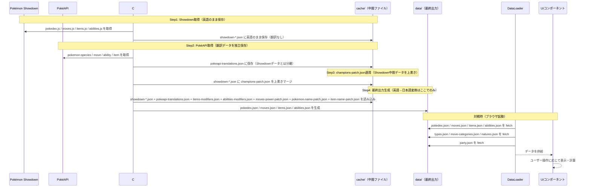

# 技術仕様書 (Architecture Design Document)

## システム全体像

pokelens は2つの独立したサブシステムで構成される:

| サブシステム | 言語 | 実行タイミング | 役割 |
|------------|------|--------------|------|
| **C# データ準備ツール** | C# (.NET) | オフライン（事前・更新時のみ） | Pokémon Showdown データ取得・JSON変換 |
| **JavaScript フロントエンド** | JavaScript (ESM) | ブラウザ（対戦時） | UI表示・計算・情報参照 |

ランタイムに外部通信は発生しない。データはすべてローカル JSON ファイルとして保持する。

---

## テクノロジースタック

### JavaScript フロントエンド

| 技術 | バージョン | 用途 | 選定理由 |
|------|-----------|------|----------|
| JavaScript (ESM) | ES2022以上 | フロントエンド実装 | TypeScript不要のシンプルな個人ツール。ブラウザネイティブで動作し依存を最小化 |
| Vite | ^6.0.0 | ローカル開発サーバー・ビルド | 設定ゼロで ESM 対応の開発サーバーが立ち上がり、JSONの fetch が CORS 問題なく動作する |
| Vitest | ^2.0.0 | テスト | Vite と統合されており設定不要。JavaScript 対応 |
| @vitest/coverage-v8 | ^2.0.0 | カバレッジ計測 | Vitest 公式のカバレッジプロバイダー。V8 ネイティブで追加設定不要 |
| ESLint | ^9.0.0 | 静的解析 | コード品質維持 |
| Prettier | ^3.2.0 | フォーマット | スタイル統一 |
| @playwright/test | ^1.60.0 | E2E テスト | Chromium 自動操作・Vite dev サーバー連携・`page.route()` による fetch mock を標準提供 |

### C# データ準備ツール

| 技術 | バージョン | 用途 | 選定理由 |
|------|-----------|------|----------|
| .NET | 8.0 (LTS) | ランタイム | 2026年11月まで長期サポート。HttpClient・System.Text.Json が標準搭載でデータ取得・変換に必要な機能が揃っている |
| HttpClient | 標準 | Showdownデータ取得 | .NET 標準。外部ライブラリ不要 |
| System.Text.Json | 標準 | JSON変換 | .NET 標準。高速で依存なし |

### フロントエンド UI フレームワーク

**現時点では Vanilla JS（フレームワークなし）を採用する**。

理由:
- 対象画面数が少ない（1画面＋詳細パネル）
- 追加の依存を避けてローカル起動を簡単に保つ
- 将来的に複雑化した場合は Preact/Vue 等へ移行を検討

---

## アーキテクチャパターン

### フロントエンド: 3層構成

```
┌──────────────────────────────────────────┐
│  UI レイヤー                              │  DOM操作・イベント処理・表示
│  OwnPartyPanel / OwnPokemonDetail /      │
│  OpponentPartyPanel / OpponentPokemonDetail /   │
│  SearchInput / dom-utils / stat-labels   │
├──────────────────────────────────────────┤
│  ロジックレイヤー                          │  計算・検索（純粋関数）
│  PowerIndexCalc / SpeedCalc / NameSearch │
│  / CalcActualStats / ResolveModifier / constants │
├──────────────────────────────────────────┤
│  データアクセスレイヤー                    │  JSON読み込み・キャッシュ
│  DataLoader（src/data/loader.js）        │
└──────────────────────────────────────────┘
            ↓ fetch (起動時のみ)
┌──────────────────────────────────────────┐
│  データ (JSONファイル)                     │
│  data/pokedex.json                       │
│  data/moves.json                         │
│  data/items.json                         │
│  data/abilities.json                     │
│  data/natures.json                       │
│  data/types.json                         │
│  data/move-categories.json               │
│  data/party.json                         │
└──────────────────────────────────────────┘
```

**レイヤールール**:
- UI レイヤーはロジックレイヤーとデータアクセスレイヤーを呼び出す。JSON を直接 fetch しない
- ロジックレイヤーは DOM に触れない。`src/data/` を直接 import しない。計算に必要なデータは UIレイヤーが DataLoader から取得して引数として渡す
- ロジックレイヤーの計算関数は純粋関数として実装し、副作用を持たない（PowerIndexCalc / SpeedCalc / CalcActualStats / NameSearch / ResolveModifier）。`constants` はドメイン区分値（MODIFIER_KIND 等）の定数集約モジュールで、純粋なエクスポートのみ
- データアクセスレイヤー（DataLoader）は DOM に触れない

### C# ツール: パイプライン構成

```
[Step 1] ShowdownFetcher  →  cache/showdown-*.json        （英語のまま保持。翻訳なし）
                                                            ※ `isNonstandard` のアイテム・特性、`isZ`/`isMax` の技は取得時点で除外
[Step 2] PokeAPIFetcher   →  cache/pokeapi-translations.json  （日本語翻訳のみ。独立保持）
                                                              ※ ポケモンはフォルム認識 (`pokemon-form` API + species 補完)、
                                                                 アイテムは slug ベース lookup
[Step 3] champions-patch.json 適用  →  Showdown中間データを上書き
[Step 4] MergeConverter   →  data/pokedex.json            （最終出力: 両データをマージ）
                          →  data/moves.json
                          →  data/items.json
                          →  data/abilities.json
         ※入力: showdown-*.json + pokeapi-translations.json + items-modifiers.json + abilities-modifiers.json
              + moves-power-patch.json + pokemon-name-patch.json + item-name-patch.json
```

**増分実行**:
ツール起動のたびに Step1（Showdown取得）を実行し、`cache/checksums.json` に保存した前回のハッシュ値と比較する。**Step1 は毎回必ず実行される**。以下の表が Step1 完了後のスキップ条件を定義する。変化があったステップ以降のみ実行し、変化がなければ後続をスキップする。

| 変化したファイル | 実行するステップ |
|----------------|----------------|
| `showdown-*.json` | Step2〜4 を実行 |
| `pokeapi-translations.json` のみ | Step4 のみ実行 |
| `champions-patch.json` のみ | Step3 以降を実行 |
| `moves-power-patch.json` のみ | Step4 のみ実行 |
| `items-modifiers.json` または `abilities-modifiers.json` のみ | Step4 のみ実行 |
| `pokemon-name-patch.json` または `item-name-patch.json` のみ | Step4 のみ実行 |
| 変化なし | 全ステップスキップ |

詳細（複数ファイルが同時に変化した場合の判定ロジック等）は機能設計書「増分実行の仕組み（ハッシュ比較）」を参照。

**データソース分離の原則**:
- Showdown から取得したデータは英語のまま `cache/showdown-*.json` に保持し、翻訳しない
- PokéAPI から取得したデータは `cache/pokeapi-translations.json` に独立して保持する
- 英語→日本語変換は MergeConverter（最終出力生成ステップ）でのみ行う
- Showdown データの更新と PokéAPI 翻訳データの更新は独立して実行できる

---

## データ永続化戦略

| データ種別 | ストレージ | フォーマット | 備考 |
|-----------|----------|-------------|------|
| ポケモンマスターデータ | ローカルファイル | JSON | C# ツールが生成。手編集不要 |
| 自分パーティ | ローカルファイル | JSON | ユーザーが手編集 |
| 相手パーティ（対戦中） | ブラウザメモリ | JS オブジェクト | ページリロードで初期化。永続化しない |

バックアップ不要（マスターデータは C# ツールで再生成可能。パーティデータはユーザーが管理）。

---

## データフロー



---

## モジュール構成

```
src/
├── main.js                # エントリーポイント（UIコンポーネント初期化・DataLoader起動）
├── styles.css             # 全 UI のスタイルシート（main.js から import、Vite がバンドル）
├── data/
│   └── loader.js          # JSON読み込み・キャッシュ（src/ 配下にはコードのみ。データファイルは置かない）
├── logic/
│   ├── power-index-calc.js   # 火力指数計算（純粋関数）
│   ├── speed-calc.js         # 素早さ4パターン計算（純粋関数）
│   ├── endurance-index-calc.js  # 耐久指数計算（純粋関数）
│   ├── name-search.js        # ひらがな/カタカナ正規化・前方一致検索
│   ├── calc-actual-stats.js  # 実数値計算（純粋関数）
│   ├── resolve-modifier.js   # 特性・持ち物の補正条件解決（純粋関数）
│   └── constants.js          # ドメイン区分値（MODIFIER_KIND 等の純粋エクスポート）
└── ui/
    ├── own-party-panel.js     # 自分パーティ一覧 (OwnPartyPanel)
    ├── own-pokemon-detail.js      # 自分ポケモン詳細 (OwnPokemonDetail)
    ├── opponent-party-panel.js  # 相手パーティ入力 (OpponentPartyPanel)
    ├── opponent-pokemon-detail.js # 相手ポケモン詳細 (OpponentPokemonDetail)
    ├── search-input.js    # サジェスト検索 (SearchInput)
    ├── dom-utils.js       # 共通 DOM 操作ヘルパー（el() 等）
    └── stat-labels.js     # 種族値・実数値の表示ラベル定義と整形ヘルパー

tools/                     # C# データ準備ツール
├── PokelensTools/
│   ├── PokelensTools.csproj
│   ├── Program.cs
│   └── Patches/                       # 手動管理 JSON 群
│       ├── champions-patch.json       # Champions差分パッチ
│       ├── moves-power-patch.json     # 威力不定技（power: null）の最大威力定義
│       ├── items-modifiers.json       # 持ち物補正値定義（Showdown英語キー）。Step4でMergeConverterが参照
│       ├── abilities-modifiers.json   # 特性補正値定義（Showdown英語キー）。Step4でMergeConverterが参照
│       ├── pokemon-name-patch.json    # ポケモン日本語名の上書き（PokéAPIでフォルム名が一意化されない場合の補正）
│       └── item-name-patch.json       # 持ち物日本語名の上書き（PokéAPIにない/誤訳されている場合の補正）
└── PokelensTools.Tests/          # xUnit テストプロジェクト（tools/ 直下、PokelensTools/ と兄弟）
    └── PokelensTools.Tests.csproj

cache/                     # C# ツールの中間データ（gitignore対象）
├── showdown-pokedex.json    # Showdownから取得した英語データ
├── showdown-moves.json
├── showdown-items.json
├── showdown-abilities.json
├── pokeapi-translations.json  # PokéAPIから取得した日本語翻訳データ
└── checksums.json             # 増分実行用ハッシュ値

data/
├── pokedex.json           # C# ツールが生成: ポケモン図鑑データ
├── moves.json             # C# ツールが生成: 技データ
├── items.json             # C# ツールが生成: 持ち物補正データ
├── abilities.json         # C# ツールが生成: 特性補正データ
├── types.json             # 手書き管理: タイプ名日本語変換マップ
├── move-categories.json   # 手書き管理: 技分類日本語変換マップ
├── natures.json           # 手書き管理: 性格補正倍率マップ
└── party.json             # ユーザー手編集

index.html                 # エントリーポイント（DOM 構造のみ。スタイルは src/styles.css）
```

---

## データ参照ルール

**原則**: フロントエンド (`src/`) が参照するデータは `data/` 配下のマスターデータのみとする。`src/` 配下に JSON 等のデータファイルを配置してはならない。

**配置先のルール**:

| 種別 | 配置先 | 生成・管理方法 |
|---|---|---|
| マスターデータ | `data/` 配下 | C# パイプラインで Showdown / PokéAPI から自動生成・再生成可能 |
| 手動補正・パッチデータ | `tools/PokelensTools/Patches/` | C# パイプラインがマスターデータ生成時に適用 |
| フロントエンドのコード | `src/` 配下 | データ参照は `data/` 配下のファイルのみ。`src/data/` にもコード (`loader.js` 等) のみを置き、JSON 等のデータファイルは置かない |
| テストフィクスチャ | `tests/` 配下 | 本番データ経路には乗らない。テスト内で `data/` の代替として注入する |

**根拠**:

- **真実源の単一化**: データソースを `data/` (マスター) に一本化することで、複数ソース間のドリフト (例: `src/data/foo.json` と `data/foo.json` が乖離する) を防ぐ
- **再生成可能性**: マスターデータが完全に再生成可能であるため、Showdown の上流変更を安全に取り込める。`src/` に手動メンテのデータがあると、上流再取得のたびに整合性チェックが必要になる
- **補正データもパイプライン経由**: フロントエンドが特定の補正データに依存する場合、その補正は必ず `tools/PokelensTools/Patches/` を経由してマスターデータに統合する。これにより全体整合性が保たれる

**過去の違反事例（再発防止のため記録）**: 機能 7（メガシンカ対応）の初回実装時、メガシンカ関連の親 → メガ・対応メガストーンのマッピングを `src/data/mega-evolutions.json` として手動配置した。これは本ルールに違反しており、フロントエンドが `data/pokedex.json` と `src/data/mega-evolutions.json` の 2 系統を参照する状態を作った。P0.5 でメガデータをマスター (`data/pokedex.json` の `megaForms[]` ネスト) に統合し本ルールに復帰させた。詳細は `docs/functional-design.md` の Pokedex エンティティ参照。

---

## パフォーマンス要件

| 操作 | 目標時間 | 測定方法 |
|------|---------|---------|
| 起動時 JSON 読み込み | 300ms以内 | DevTools Network タブで計測 |
| ポケモン名サジェスト表示 | 100ms以内 | `input` イベントから描画完了まで |
| ポケモン詳細切り替え | 200ms以内 | クリックから表示更新まで |

---

## セキュリティ

ローカル専用ツールのため外部攻撃面は限定的だが、以下を考慮する:

- **入力検証**: サジェスト検索はマスターデータに存在するポケモン名のみを候補として使用する。任意の文字列をそのまま DOM に挿入しない（innerHTML ではなく textContent を使用）
- **外部通信**: ランタイムに外部 API を呼び出さない。C# ツール実行時のみ通信が発生する
- **アクセス範囲**: Vite 開発サーバーは `localhost` のみでリッスンする。LAN 上の他端末からはアクセスできない

---

## テスト戦略

| 種別 | ツール | 対象 |
|------|--------|------|
| ユニットテスト（JS） | Vitest | `logic/` 配下の純粋関数（火力指数・素早さ計算・検索正規化・実数値・補正条件解決）と DataLoader |
| ユニットテスト（C#） | xUnit | MergeConverter・パッチ適用・増分実行判定・日本語キー変換 |
| 統合テスト（C#） | xUnit | パイプライン全体のスナップショットテスト |
| E2E テスト | Playwright（Chromium） | UI 結合・画面表示・サジェスト・火力指数 UI 反映・XSS 耐性 |
| 手動テスト | ブラウザ | 環境セットアップ・C# データ生成・dev サーバー起動（[`docs/testing/e2e/manual-test-cases.md`](./testing/e2e/manual-test-cases.md)） |

> JS の統合テスト層は P0 では設けない。DataLoader → UI のデータ供給は単体テスト（DataLoader 単独）と E2E（Playwright）で担保する。

カバレッジ目標: ロジックレイヤー（`src/logic/`）80% 以上（計測: `npm run test:coverage`）

> UIレイヤー（`src/ui/`）は単体テスト対象外とし、E2E（Playwright）が UI 結合・画面表示・サジェスト・火力指数 UI 反映を担保する。`src/data/loader.js` は単体テスト（`tests/unit/loader.test.js`）で正常系とエラーパスをカバーしているが、DOM 依存部分の計測が困難なため数値目標は設けない。

テストファイルの配置: JS テストは `tests/unit/`（ユニット）および `tests/e2e/`（E2E、Playwright）、C# テストは `tools/PokelensTools.Tests/`（詳細は `docs/repository-structure.md` を参照）

---

## 技術的制約

### 環境要件
- **ブラウザ**: Chrome 最新版（ES2022 ESM対応）
- **開発環境**: Node.js LTS（Vite・Vitest 実行用）
- **.NET**: 8.0 以上（C# ツール実行用）
- **ディスク**: 10MB 以下（4つのJSONファイル合計でポケモン全種データは数MB程度）

### 制約事項
- `file://` プロトコルでは fetch が CORS 制限を受けるため、**必ず Vite 経由でローカルサーバーを起動して使用する**（起動コマンド: `npm run dev`。詳細は `docs/development-guidelines.md` を参照）
- Pokémon Showdown データは定期的に更新されるため、バージョン対応は C# ツールを再実行して対応する

---

## 依存関係管理

| ライブラリ | 用途 | バージョン管理方針 |
|-----------|------|-------------------|
| vitest | テスト | `^2.0.0`（マイナーまで許可） |
| @vitest/coverage-v8 | カバレッジ計測 | `^2.0.0` |
| eslint | 静的解析 | `^9.0.0` |
| prettier | フォーマット | `^3.2.0` |
| vite | 開発サーバー・ビルド | `^6.0.0` |
| @playwright/test | E2E テスト | `^1.60.0` |
