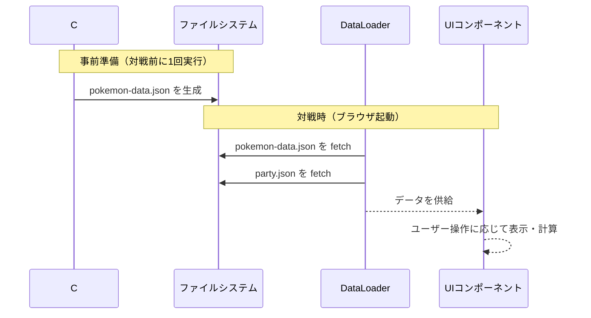

# 技術仕様書 (Architecture Design Document)

## システム全体像

pokelens は2つの独立したサブシステムで構成される:

| サブシステム | 言語 | 実行タイミング | 役割 |
|------------|------|--------------|------|
| **C# データ準備ツール** | C# (.NET) | オフライン（事前・更新時のみ） | Pokémon Showdown データ取得・JSON変換 |
| **JavaScript フロントエンド** | JavaScript (ESM) | ブラウザ（対戦時） | UI表示・計算・情報参照 |

ランタイムに外部通信は発生しない。データはすべてローカル JSON ファイルとして保持する。

---

## テクノロジースタック

### JavaScript フロントエンド

| 技術 | バージョン | 用途 | 選定理由 |
|------|-----------|------|----------|
| JavaScript (ESM) | ES2022以上 | フロントエンド実装 | TypeScript不要のシンプルな個人ツール。ブラウザネイティブで動作し依存を最小化 |
| Vite | 最新安定版 | ローカル開発サーバー・ビルド | 設定ゼロで ESM 対応の開発サーバーが立ち上がり、JSONの fetch が CORS 問題なく動作する |
| Vitest | ^2.0.0 | テスト | Vite と統合されており設定不要。JavaScript 対応 |
| ESLint | ^9.0.0 | 静的解析 | コード品質維持 |
| Prettier | ^3.2.0 | フォーマット | スタイル統一 |
| Husky + lint-staged | 最新 | コミット前自動チェック | 品質ゲート |

### C# データ準備ツール

| 技術 | バージョン | 用途 | 選定理由 |
|------|-----------|------|----------|
| .NET | 8.0 (LTS) | ランタイム | 2026年11月まで長期サポート。HttpClient・System.Text.Json が標準搭載でデータ取得・変換に必要な機能が揃っている |
| HttpClient | 標準 | Showdownデータ取得 | .NET 標準。外部ライブラリ不要 |
| System.Text.Json | 標準 | JSON変換 | .NET 標準。高速で依存なし |

### フロントエンド UI フレームワーク

**現時点では Vanilla JS（フレームワークなし）を採用する**。

理由:
- 対象画面数が少ない（1画面＋詳細パネル）
- 追加の依存を避けてローカル起動を簡単に保つ
- 将来的に複雑化した場合は Preact/Vue 等へ移行を検討

---

## アーキテクチャパターン

### フロントエンド: 2層構成

```
┌──────────────────────────────────┐
│  UI レイヤー                      │  DOM操作・イベント処理・表示
│  PartyPanel / OwnDetail /        │
│  OpponentDetail / SearchInput    │
├──────────────────────────────────┤
│  ロジックレイヤー                  │  計算・検索・データ変換
│  PowerIndexCalc / SpeedCalc /    │
│  DataLoader / NameNormalizer     │
└──────────────────────────────────┘
            ↓ fetch (起動時のみ)
┌──────────────────────────────────┐
│  データ (JSONファイル)             │
│  data/pokemon-data.json          │
│  data/party.json                 │
└──────────────────────────────────┘
```

**レイヤールール**:
- UI レイヤーはロジックレイヤーを呼び出すのみ。JSON を直接 fetch しない
- ロジックレイヤーは DOM に触れない
- 計算関数は純粋関数として実装し、副作用を持たない

### C# ツール: パイプライン構成

```
ShowdownFetcher → JsonConverter → pokemon-data.json
```

---

## データ永続化戦略

| データ種別 | ストレージ | フォーマット | 備考 |
|-----------|----------|-------------|------|
| ポケモンマスターデータ | ローカルファイル | JSON | C# ツールが生成。手編集不要 |
| 自分パーティ | ローカルファイル | JSON | ユーザーが手編集 |
| 相手パーティ（対戦中） | ブラウザメモリ | JS オブジェクト | ページリロードで初期化。永続化しない |

バックアップ不要（マスターデータは C# ツールで再生成可能。パーティデータはユーザーが管理）。

---

## データフロー



---

## モジュール構成

```
src/
├── data/
│   └── loader.js          # JSON読み込み・キャッシュ
├── logic/
│   ├── power-index.js     # 火力指数計算（純粋関数）
│   ├── speed-calc.js      # 素早さ4パターン計算（純粋関数）
│   └── name-search.js     # ひらがな/カタカナ正規化・前方一致検索
└── ui/
    ├── party-panel.js     # 自分パーティ一覧
    ├── own-detail.js      # 自分ポケモン詳細
    ├── opponent-panel.js  # 相手パーティ入力
    ├── opponent-detail.js # 相手ポケモン詳細
    └── search-input.js    # サジェスト検索

tools/                     # C# データ準備ツール
└── ShowdownFetcher/
    ├── ShowdownFetcher.csproj
    └── Program.cs

data/
├── pokemon-data.json      # C# ツールが生成
└── party.json             # ユーザー手編集

index.html                 # エントリーポイント
```

---

## パフォーマンス要件

| 操作 | 目標時間 | 測定方法 |
|------|---------|---------|
| 起動時 JSON 読み込み | 300ms以内 | DevTools Network タブで計測 |
| ポケモン名サジェスト表示 | 100ms以内 | `input` イベントから描画完了まで |
| ポケモン詳細切り替え | 200ms以内 | クリックから表示更新まで |

---

## セキュリティ

ローカル専用ツールのため外部攻撃面は限定的だが、以下を考慮する:

- **入力検証**: サジェスト検索はマスターデータに存在するポケモン名のみを候補として使用する。任意の文字列をそのまま DOM に挿入しない（innerHTML ではなく textContent を使用）
- **外部通信**: ランタイムに外部 API を呼び出さない。C# ツール実行時のみ通信が発生する

---

## テスト戦略

| 種別 | ツール | 対象 |
|------|--------|------|
| ユニットテスト | Vitest | `logic/` 配下の純粋関数（火力指数・素早さ計算・検索正規化） |
| 統合テスト | Vitest | DataLoader → UI へのデータ供給フロー |
| 手動テスト | ブラウザ | UI・サジェスト動作・表示確認 |

カバレッジ目標: ロジックレイヤー 80% 以上

---

## 技術的制約

### 環境要件
- **ブラウザ**: Chrome 最新版（ES2022 ESM対応）
- **開発環境**: Node.js LTS（Vite・Vitest 実行用）
- **.NET**: 8.0 以上（C# ツール実行用）
- **ディスク**: 10MB 以下（pokemon-data.json はポケモン全種で数MB程度）

### 制約事項
- `file://` プロトコルでは fetch が CORS 制限を受けるため、**必ず Vite 経由でローカルサーバーを起動して使用する**
- Pokémon Showdown データは定期的に更新されるため、バージョン対応は C# ツールを再実行して対応する

---

## 依存関係管理

| ライブラリ | 用途 | バージョン管理方針 |
|-----------|------|-------------------|
| vitest | テスト | `^2.0.0`（マイナーまで許可） |
| @vitest/coverage-v8 | カバレッジ計測 | `^2.0.0` |
| eslint | 静的解析 | `^9.0.0` |
| prettier | フォーマット | `^3.2.0` |
| vite | 開発サーバー・ビルド | `^6.0.0` |
| husky | コミットフック | `^9.0.0` |
| lint-staged | コミット前処理 | `^15.2.0` |
