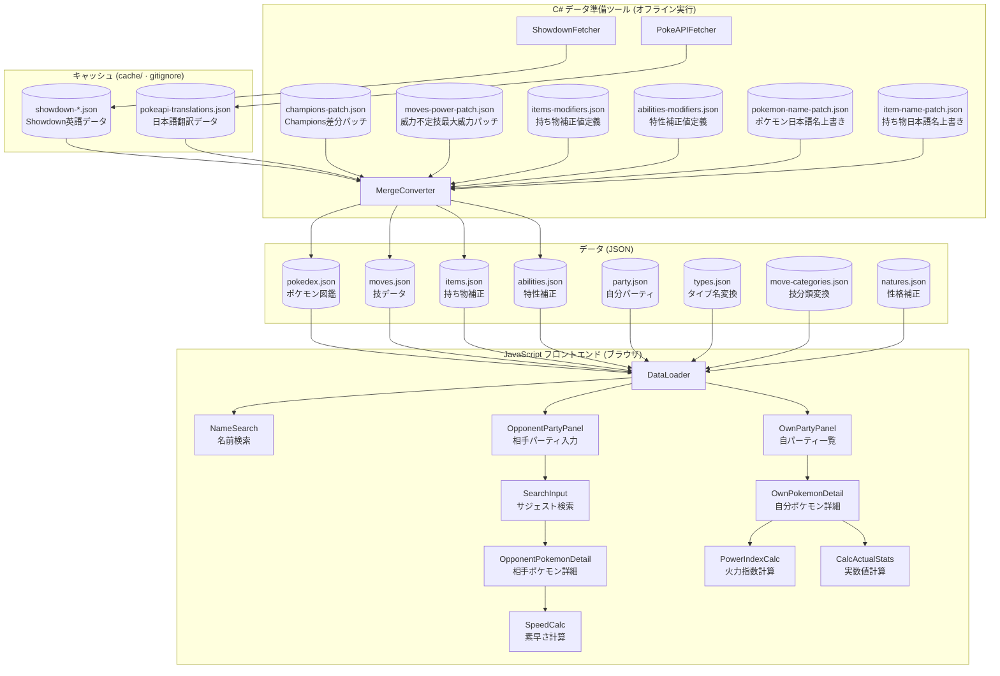
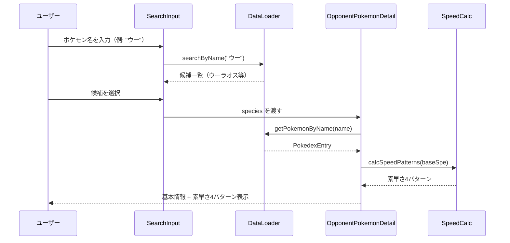
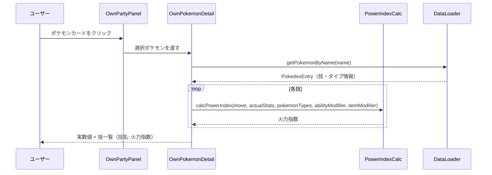
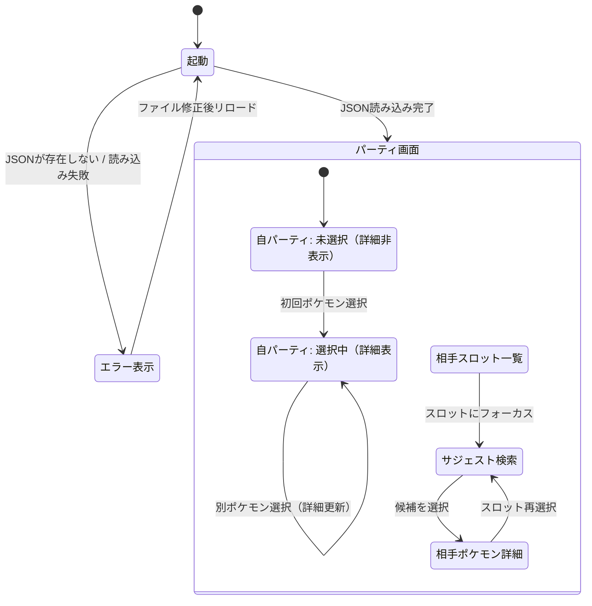

# 機能設計書 (Functional Design Document)

## システム構成図



---

## 技術スタック

| 分類 | 技術 | 選定理由 |
|------|------|----------|
| フロントエンド言語 | JavaScript (ESモジュール) | TypeScript不要のシンプルな個人ツール |
| フロントエンドフレームワーク | Vanilla JS（フレームワークなし） | 画面数が少なく依存を最小化。詳細は architecture.md を参照 |
| スタイリング | CSS | 追加依存なし |
| データ取得・変換 | C# (.NET) | JSON操作と外部データ取得が得意 |
| マスターデータ | Pokémon Showdown データ | 対戦用途に必要な情報を網羅 |
| 日本語名変換 | PokéAPI | ポケモン・技・特性の日本語名を取得（C# ツールのオフライン実行時のみ使用） |
| テスト | Vitest | JavaScript対応、高速 |

---

## C# データ準備ツール: データ取得と変換

### 対応バージョン

**Pokémon Champions** のデータを対象とする。

**データ戦略**:
- Pokémon Showdown は現時点で Pokémon Champions に未対応のため、Showdown データをベースとして使用し、ポケモンWiki（https://wiki.pokemonwiki.com/wiki/Pok%C3%A9mon_Champions）で調査した Champions との差分を静的パッチとして適用する
- Pokémon Champions は既存要素の変更のみ（新規ポケモン・技・アイテムなし）のため、PokéAPI は英語→日本語名の変換にのみ使用する
- 本ツールは開発者自身のみの利用を想定しており、多言語対応は行わない。UI・データともに日本語に固定する

### データソース分離の原則

- **Showdown データ**は取得した英語のまま中間ファイルとして保持し、変換・翻訳を行わない
- **PokéAPI データ**は独立した中間ファイルとして保持し、Showdown データとは分離する
- 英語→日本語変換が必要な最終出力生成時のみ、両データを結合する

### 取得元URL

**Pokémon Showdown（コンパイル済みJS）**

| データ | URL | 取得内容 |
|--------|-----|----------|
| ポケモン | `https://play.pokemonshowdown.com/data/pokedex.js` | タイプ・種族値・特性リスト |
| 技 | `https://play.pokemonshowdown.com/data/moves.js` | 技名・タイプ・分類・威力・フラグ |
| 持ち物 | `https://play.pokemonshowdown.com/data/items.js` | 持ち物名・各種フラグ |
| 特性 | `https://play.pokemonshowdown.com/data/abilities.js` | num（PokéAPI連携用。英語名は不要なので保存しない。詳細は後述の Step1 抽出ロジック参照） |

**PokéAPI（日本語名変換のみ）**

| データ | URL | 取得内容 |
|--------|-----|----------|
| ポケモン日本語名（変異フォルム） | `https://pokeapi.co/api/v2/pokemon-form/{slug}/` | `form_names` 配列から `language.name === "ja"` の `name` を取得（フォルム別の在ゲーム名） |
| ポケモン日本語名（基本形・フォルム fallback） | `https://pokeapi.co/api/v2/pokemon-species/{id}/` | `names` 配列の `language.name === "ja"` から種族名を取得 |
| 技日本語名 | `https://pokeapi.co/api/v2/move/{id}/` | `names` 配列から `language.name === "ja"` の `name` を取得 |
| 特性日本語名 | `https://pokeapi.co/api/v2/ability/{id}/` | `names` 配列から `language.name === "ja"` の `name` を取得 |
| 持ち物日本語名 | `https://pokeapi.co/api/v2/item/{slug}/` | `names` 配列から `language.name === "ja"` の `name` を取得（Showdown と PokéAPI で ID 体系が異なるため slug で照合） |

**ID/slug の対応規則**:
- ポケモン基本形・技・特性は Showdownの `num` フィールドを PokéAPI ID として利用する
- **ポケモン変異フォルム**は Showdown の `name` フィールド（例: `"Rotom-Wash"`）を slugify（lowercase / 空白→`-` / `' '` `’` `.` `:` `,` `%` を除去 / `é`→`e`）して `pokemon-form/{slug}/` を問い合わせ、`form_names` の日本語表記（例: `"ウォッシュロトム"`）を取得する。slug が PokéAPI に存在しない場合は `pokemon-species/{num}/` の `varieties` から最長一致するスラグへフォールバックする
- **PokéAPI が form qualifier のみを返すケース**（例: `zacian-crowned` → `"けんのおう"`）では、種族名を含まないため `"<種族名> (<フォルム名>)"` の形式に MergeConverter が組み立てる
- **持ち物**は Showdown と PokéAPI で ID が乖離しているため、Showdownの `name`（例: `"Wellspring Mask"`）を slugify した値で `item/{slug}/` を直接問い合わせる

**ポケモンWiki（Champions差分・手動調査）**

Showdown データと Pokémon Champions の差分（技威力・種族値変更など）をポケモンWiki（https://wiki.pokemonwiki.com/wiki/Pok%C3%A9mon_Champions）で調査し、`tools/PokelensTools/Patches/champions-patch.json` に静的パッチとして管理する。C# ツールはShowdownデータ変換後にパッチを上書き適用する。

**`champions-patch.json` の構造**:

```json
{
  "pokedex": {
    "dragonite": {
      "baseStats": { "hp": 91, "atk": 140, "def": 95, "spa": 100, "spd": 100, "spe": 80 }
    },
    "rillaboom": {
      "baseStats": { "hp": 100, "atk": 125, "def": 90, "spa": 60, "spd": 70, "spe": 85 },
      "abilities": { "0": "Overgrow", "H": "Grassy Surge" }
    }
  },
  "moves": {
    "thunder": {
      "basePower": 120,
      "accuracy": 70
    },
    "rockslide": {
      "basePower": 80
    }
  }
}
```

> キーはShowdownの識別キー（英小文字・スペースなし）。ポケモンは `cache/showdown-pokedex.json`、技は `cache/showdown-moves.json` のキーと一致させること。

**制約**:
- キーはShowdownの識別キー（英小文字）。`pokedex` キーはShowdownの `cache/showdown-pokedex.json`、`moves` キーは `cache/showdown-moves.json` のキーと対応する
- パッチ適用は**上書きマージ**（指定したフィールドのみ差し替え。省略フィールドはShowdownデータをそのまま使用）
- `pokedex` で変更可能なフィールド: `baseStats`（一部または全6値）、`types`（配列）、`abilities`（オブジェクト。キーはShowdownスロット規則: `"0"` = 第1特性、`"1"` = 第2特性、`"H"` = 隠れ特性）
- `moves` で変更可能なフィールド: `basePower`（整数。必中・変化技は `0`）、`accuracy`（整数。必中は `true`）、`category`（`"Physical"` / `"Special"` / `"Status"`）
- このファイルは手書きで管理する（C# ツールでは生成しない）

> **ゲームアップデート時の注意**: Pokémon Champions のアップデートで新規ポケモン・新規技・新規持ち物・新規特性が追加された場合、Showdown データソースへの反映状況を確認した上で、必要に応じて C# パイプライン・`champions-patch.json`・各種手書き JSON（`items.json`・`abilities.json`・`natures.json` の静的テーブル）の更新対応が別途必要になる。

**`moves-power-patch.json` の構造**:

```json
{
  "metronome":   { "power": 120 },
  "weatherball": { "power": 100 },
  "magnitude":   { "power": 150 }
}
```

> キーはShowdownの識別キー（英小文字）。`cache/showdown-moves.json` のキーと一致させること。Step4のMergeConverterはShowdown英語キーで `moves-power-patch.json` を照合してから `pokeapi-translations.json` で日本語キーへ変換するため、このファイルのキーは最終出力 `moves.json` の日本語キーではなくShowdown英語キーで記述する（例: `"わるあがき"` ではなく `"struggle"`）。

**制約**:
- エントリは `{ "power": <整数> }` のフラット形式で記述する（`items-modifiers.json` / `abilities-modifiers.json` の `{ "modifier": { ... } }` ラッパー形式とは異なる。このファイルは `moves.json` の単一フィールドを上書きするだけのため、ラッパーは不要）
- `power` は整数。Showdownデータで威力が `null`（変動技）となる技に最大威力を設定する
  - フィールド名 `power` は最終出力 `moves.json` の `power` フィールドに直接対応する語彙。`champions-patch.json` の `moves.basePower`（Showdown語彙）とは別物
- C# ツールがStep4の最終出力生成時に `moves.json` の `power` フィールドへ上書き適用する
- `champions-patch.json` の `moves` セクションとは役割が異なる（`champions-patch.json` の `basePower` はShowdown語彙でStep3に適用、`moves-power-patch.json` の `power` は最終出力語彙でStep4に適用）
- このファイルは手書きで管理する（C# ツールでは生成しない）
- 完全可変技（カウンター、ミラーコート、メタルバースト、いのちがけ、がむしゃら、ふくろだたき 等）、HP比例技（いかりのまえば、カタストロフィ 等）、OHKO技（じわれ、つのドリル、ぜったいれいど、ハサミギロチン）は patch しないポリシー（`power: null` のまま）。UI 側で「—」表示する

**`pokemon-name-patch.json` の構造**:

```json
{
  "_comment": "Override JP names for Showdown formes that PokéAPI cannot uniquely identify.",
  "taurospaldeacombat":   "ケンタロス (パルデアのすがた・コンバット種)",
  "darmanitangalarzen":   "ヒヒダルマ (ガラルのすがた・ダルマモード)",
  "greninjabond":         "ゲッコウガ (バトルボンド)",
  "ogerpontealtera":      "オーガポン (みどりのめん・テラスタル)",
  "miniormeteor":         "メテノ (りゅうせいのすがた)"
}
```

> キーは Showdown のポケモン識別キー（英小文字）、値は日本語名。`cache/showdown-pokedex.json` のキーと一致させること。

**制約**:
- MergeConverter は Showdown の各エントリに対し、まず `pokeapi-translations.json` の `pokemon` セクションから日本語名を解決し、本ファイルに同キーのエントリがあれば**最終出力に出る前に上書き**する
- 同名重複を解消する目的のため、すべての値は出力 `pokedex.json` 内で他エントリと一意であることが望ましい
- 補正対象は以下の 4 カテゴリ:
  - **PokéAPI の翻訳データバグ** (例: パルデアケンタロス3種が同名)
  - **PokéAPI の `form_names` が空** (例: バトルボンドゲッコウガ)
  - **PokéAPI に該当エンドポイントが無い** (例: オーガポン Tera フォルム、Showdown 専用の偽メガ進化)
  - **スラグ不一致による fallback の衝突** (例: メテノの Core/Meteor、ピチュー ギザみみ)
- 先頭 `_` で始まるキー (`_comment` 等) は Showdown キーと衝突しないため副作用なし。コメント用途に利用できる
- このファイルは手書きで管理する（C# ツールでは生成しない）

**`item-name-patch.json` の構造**:

```json
{
  "_comment": "Override JP names for items that PokéAPI lacks or returns incorrect data for.",
  "masterpieceteacup": "ケッサクのちゃわん",
  "metalalloy":        "ふくごうきんぞく",
  "prettyfeather":     "きれいなハネ"
}
```

> キーは Showdown の持ち物識別キー（英小文字）、値は日本語名。`cache/showdown-items.json` のキーと一致させること。

**制約**:
- MergeConverter は `data/items.json` 生成時、`items-modifiers.json` の各キーに対し、本ファイルに同キーのエントリがあれば**翻訳より優先**して日本語名として採用する。エントリがなければ `pokeapi-translations.json` の `items` セクションをフォールバックとして使う
- 補正対象は以下の 3 カテゴリ:
  - **PokéAPI のデータバグで翻訳が誤っている** (例: ケッサクのちゃわん が PokéAPI ja で "ボンサクのちゃわん" を返す)
  - **PokéAPI に該当 slug の翻訳が登録されていない** (例: メタルアロイ → ふくごうきんぞく)
  - **PokéAPI に該当 slug の項目自体が無い** (例: きれいなハネ)
- 先頭 `_` で始まるキー (`_comment` 等) は Showdown キーと衝突しないため副作用なし
- このファイルは手書きで管理する（C# ツールでは生成しない）

**Showdown データの除外フィルタ** (ShowdownFetcher 取得時):

| 対象 | フィルタ条件 | 理由 |
|---|---|---|
| 技 (`isZ` または `isMax` あり) | `entry.isZ != null \|\| entry.isMax != null` | Zワザ・ダイマックスワザ・キョダイマックスワザは現代対戦 (Gen 9 標準) で使用不可。`isZ` には Z-クリスタル名 (例: `"electriumz"`) が、`isMax` には許容ポケモン名が入る |
| 特性 (`isNonstandard` あり) | `entry.isNonstandard != null` | `"Future"` (4件: piercingdrill, dragonize, megasol, spicyspray) は次世代用の仮置き |
| アイテム (`isNonstandard` あり) | `entry.isNonstandard != null` | `"Past"` (メガストーン、Zクリスタル)、`"Future"` (Z 進化アイテム)、`"Unobtainable"` (チェリッシュボール等)、`"CAP"` を除外 |

> `noability`（特性、`num=0`）と CAP ポケモン（`num<0`）は既存の `num <= 0` チェックで除外済み。

### C# ツールのパイプライン

```
[Step 1] Showdown取得 → 英語のまま中間保存
  → cache/showdown-pokedex.json   （英語。Showdownの構造を維持）
  → cache/showdown-moves.json
  → cache/showdown-items.json
  → cache/showdown-abilities.json

[Step 2] PokéAPI取得 → 翻訳データを中間保存  ※増分実行で条件付き
  → cache/pokeapi-translations.json  （英語キー→日本語名のマッピング）

[Step 3] champions-patch.json 適用 → Showdown中間データを上書き  ※増分実行で条件付き

[Step 4] 最終出力生成 (Step1 + Step2 をマージ)  ※増分実行で条件付き
  → data/pokedex.json
  → data/moves.json
  → data/items.json
  → data/abilities.json
```

**増分実行の仕組み（ハッシュ比較）**:

C# ツールは起動のたびに Step1 を実行し、その後 `cache/checksums.json` に保存した前回のハッシュ値と比較することで、後続ステップを自動決定する。

```
[Step 1] Showdown 取得 → cache/showdown-*.json を更新

[ハッシュ比較] cache/checksums.json の前回値と比較（初回起動時はスキップ）
  - showdown-*.json のみ変化              → Step 2〜4 を実行
  - pokeapi-translations.json のみ変化   → Step 4 を実行（日本語名の再マッピングのみ必要）
  - champions-patch.json のみ変化         → Step 3〜4 を実行
  - moves-power-patch.json のみ変化       → Step 4 を実行
  - items-modifiers.json のみ変化        → Step 4 を実行
  - abilities-modifiers.json のみ変化    → Step 4 を実行
  - pokemon-name-patch.json のみ変化     → Step 4 を実行
  - item-name-patch.json のみ変化        → Step 4 を実行
  - 上記の複数が同時に変化               → 必要な最も早いStep以降を実行
  - 変化なし                             → 処理終了（data/ は最新のまま）

[Step 2] PokéAPI 取得 → cache/pokeapi-translations.json  （条件付き）

[Step 3] champions-patch.json 適用 → Showdown 中間データを上書き  （条件付き）

[Step 4] 最終出力生成 → data/*.json  （条件付き）
  ※ pokedex.json 生成時に以下を適用する:
    - pokemon-name-patch.json: 翻訳された日本語名を Showdown キー単位で上書き
  ※ moves.json 生成時に以下を適用する:
    - 複数回攻撃技: basePower × multihit[1] を power として出力
    - moves-power-patch.json: power が null の技に最大威力を上書き適用
  ※ items.json 生成時に以下を適用する:
    - item-name-patch.json: 翻訳された日本語名を Showdown キー単位で上書き（翻訳が無い場合の補完も兼ねる）

[ハッシュ更新] cache/checksums.json を更新（全 patch / modifier ファイルを含む）
```

`cache/checksums.json` の構造:

```json
{
  "showdown-pokedex":        "a1b2c3...",
  "showdown-moves":          "d4e5f6...",
  "showdown-items":          "g7h8i9...",
  "showdown-abilities":      "j0k1l2...",
  "pokeapi-translations":    "s1t2u3...",
  "champions-patch":         "m3n4o5...",
  "moves-power-patch":       "p6q7r8...",
  "items-modifiers":         "v1w2x3...",
  "abilities-modifiers":     "y4z5a6...",
  "pokemon-name-patch":      "b7c8d9...",
  "item-name-patch":         "e0f1g2..."
}
```

### 中間データ形式

**`cache/showdown-pokedex.json`**:

```json
{
  "pikachu": {
    "num": 25,
    "name": "Pikachu",
    "types": ["Electric"],
    "baseStats": { "hp": 35, "atk": 55, "def": 40, "spa": 50, "spd": 50, "spe": 90 },
    "abilities": { "0": "Static", "1": "Lightning Rod" }
  },
  "rotomwash": {
    "num": 479,
    "name": "Rotom-Wash",
    "types": ["Electric", "Water"],
    "baseStats": { "hp": 50, "atk": 65, "def": 107, "spa": 105, "spd": 107, "spe": 86 },
    "abilities": { "0": "Levitate" },
    "forme": "Wash"
  }
}
```

> `abilities` のキーはShowdownの特性スロット規則: `"0"` = 第1特性、`"1"` = 第2特性、`"H"` = 隠れ特性。定義されていないスロットは省略される。`forme` は非基本フォルムのみに付与され、PokeAPIFetcher が `pokemon-form` lookup の有無を判定するのに使う。

**`cache/showdown-moves.json`**:

```json
{
  "thunderbolt": {
    "num": 85,
    "name": "Thunderbolt",
    "type": "Electric",
    "category": "Special",
    "basePower": 90,
    "accuracy": 100,
    "flags": { "protect": 1, "mirror": 1 }
  },
  "closecombat": {
    "num": 370,
    "name": "Close Combat",
    "type": "Fighting",
    "category": "Physical",
    "basePower": 120,
    "accuracy": 100,
    "flags": { "contact": 1, "protect": 1, "mirror": 1 }
  },
  "protect": {
    "num": 182,
    "name": "Protect",
    "type": "Normal",
    "category": "Status",
    "basePower": 0,
    "accuracy": true,
    "flags": {}
  }
}
```

> `basePower: 0` は変動技・変化技を表す。Step4 で `null` に変換する。`accuracy: true` は必中を表す。`flags` は `isPunch` 等の補正条件判定に使用する。
> Zワザ・ダイマックスワザ・キョダイマックスワザは ShowdownFetcher 段階で除外されるため、このファイルには含まれない（除外フラグは Showdown の `isZ` / `isMax`）。

**`cache/showdown-items.json`**:

```json
{
  "choiceband":  { "num": 220, "name": "Choice Band" },
  "choicespecs": { "num": 305, "name": "Choice Specs" },
  "choicescarf": { "num": 287, "name": "Choice Scarf" },
  "lifeorb":     { "num": 270, "name": "Life Orb" }
}
```

> Showdown の `items.js` は補正値をJavaScript関数で記述しているためパース不可。`num` と `name` のみ保持し、補正値はC#ツール内の静的テーブルから生成する。`name` は PokéAPI の item slug 派生（lowercase + 空白→`-`）に使用する。`isNonstandard` (Past / Future / Unobtainable / CAP) のアイテム約 334 件はこの段階で除外されている。

**`cache/showdown-abilities.json`**:

```json
{
  "static":       { "num": 9  },
  "lightningrod": { "num": 31 },
  "hugepower":    { "num": 37 },
  "ironfist":     { "num": 89 }
}
```

> Showdown の `abilities.js` も補正値をJavaScript関数で記述しているためパース不可。`num` のみ保持し、補正値はC#ツール内の静的テーブルから生成する。日本語名は `pokeapi-translations.json` から取得するため英語名は不要。`isNonstandard` (Past / Future / CAP) の特性 4 件はこの段階で除外されている。

**`cache/pokeapi-translations.json`（PokéAPIから取得した日本語マッピング）**:

```json
{
  "pokemon": {
    "pikachu":   "ピカチュウ",
    "rotom":     "ロトム",
    "rotomwash": "ウォッシュロトム",
    "zaciancrowned": "ザシアン (けんのおう)"
  },
  "moves": {
    "thunderbolt": "10まんボルト"
  },
  "abilities": {
    "static": "せいでんき",
    "lightning-rod": "ひらいしん"
  },
  "items": {
    "choicescarf": "こだわりスカーフ",
    "lifeorb": "いのちのたま"
  }
}
```

> キーはShowdownの識別キー（英小文字）で統一し、Showdown中間データとPokeAPI翻訳データを紐付ける基準とする。`pokemon` セクションの値は **フォルム別の日本語名**（基本形は種族名、変異フォルムは `pokemon-form` API から取得した在ゲーム表記、PokéAPIが form qualifier のみ返すケースは `<種族名> (<form>)` 形式に組み立て済み）。最終的な一意化は `pokemon-name-patch.json` が補完する。

---

### 元データ形式と変換ロジック

Showdown の `.js` ファイルは以下の形式：

```js
'use strict';
exports.BattlePokedex = {
  pikachu: { num: 25, name: "Pikachu", types: ["Electric"], baseStats: { hp: 35, ... }, ... }
};
```

C# ツールは先頭の `'use strict';\nexports.BattleXxx = ` と末尾の `;` を除去してJSONオブジェクトとしてパースする。

**変換内容**：
- ポケモン識別キー（英小文字）はShowdownのキーをそのまま使用
- `name`（日本語表記・カタカナ）はPokéAPIから取得した日本語名をそのまま使用する
- 技の `basePower: 0` は `null` に変換する（変動技・変化技）
- 技の `accuracy: true`（Showdown の必中表現）は `null` に変換する（`basePower: 0 → null` と同様の扱い）
### アイテム・特性の補正データ

Showdown の `items.js` / `abilities.js` は補正値をJavaScript関数で記述しているためC#から直接パースできない。補正値は `tools/PokelensTools/Patches/items-modifiers.json` / `tools/PokelensTools/Patches/abilities-modifiers.json` に手書きで管理し、Step4でMergeConverterが日本語名（`pokeapi-translations.json` 参照）と結合して `data/items.json` / `data/abilities.json` を生成する。新規アイテム・特性の追加やバランス変更時はこれらのJSONファイルを直接更新する。

> 方針: 「最大火力指向のため発動済みとして常時補正をかける」。タイプ・技タグで判定できる条件（`isType` / `isPunch` 等）はマスターデータに含めるが、対戦状況に依存する条件（HP・天候・状態異常・ターン数・性別等）はマスターデータに含めず P0 スコープ外として補正値 1.0 で扱う。

> 素早さ補正のみの持ち物（こだわりスカーフ等）は火力指数に影響しないため `items-modifiers.json` には含めない（SKIP ポリシー）。

**`items-modifiers.json` の構造**（キーはShowdown英語識別キー）:

```json
{
  "muscleband":    { "modifier": { "atk": 1.1 } },
  "lifeorb":       { "modifier": { "atk": 1.3, "spa": 1.3 } },
  "silkscarf":     { "modifier": { "condition": "isType", "moveType": "Normal", "atk": 1.2, "spa": 1.2 } },
  "expertbelt":    { "modifier": { "atk": 1.2, "spa": 1.2, "condition": "isStab" } },
  "punchingglove": { "modifier": { "atk": 1.1, "spa": 1.1, "condition": "isPunch" } }
}
```

> `condition` キーは省略可能。省略した場合は `null`（無条件全技適用）と同等に扱う。`lifeorb` のように物理・特殊の両方を補正する場合は `atk` と `spa` の両方を記述する。

**`abilities-modifiers.json` の構造**（キーはShowdown英語識別キー）:

```json
{
  "ironfist":      { "modifier": { "condition": "isPunch",    "atk": 1.2, "spa": 1.2 } },
  "sharpness":     { "modifier": { "condition": "isSlice",    "atk": 1.5, "spa": 1.5 } },
  "technician":    { "modifier": { "condition": "powerMax60", "atk": 1.5, "spa": 1.5 } },
  "megalauncher":  { "modifier": { "condition": "isPulse",    "atk": 1.5, "spa": 1.5 } },
  "strongjaw":     { "modifier": { "condition": "isBite",     "atk": 1.5, "spa": 1.5 } },
  "reckless":      { "modifier": { "condition": "isRecoil",   "atk": 1.2 } },
  "adaptability":  { "modifier": { "condition": "isStab",     "stab": 2.0 } },
  "toughclaws":    { "modifier": { "condition": "isContact",   "atk": 1.3, "spa": 1.3 } },
  "punkrock":      { "modifier": { "condition": "isSound",     "atk": 1.3, "spa": 1.3 } },
  "sheerforce":    { "modifier": { "condition": "hasSecondary","atk": 1.3, "spa": 1.3 } },
  "blaze":         { "modifier": { "condition": "isType", "moveType": "Fire",  "atk": 1.5, "spa": 1.5 } },
  "pixilate":      { "modifier": { "condition": "convertNormalTo", "convertedType": "Fairy", "atk": 1.2, "spa": 1.2 } },
  "normalize":     { "modifier": { "condition": "convertAllTo",    "convertedType": "Normal", "atk": 1.2, "spa": 1.2 } }
}
```

> 上記は実装の代表抜粋。完全なエントリ群と「最大火力指向のため発動済みとして常時補正をかける」ポリシーの全文は `tools/PokelensTools/Patches/abilities-modifiers.json` の `_comment_policy` を参照。

---

## データモデル定義

### エンティティ: Pokedex（ポケモン図鑑）

C# ツールが生成する `pokedex.json` の構造:

```json
{
  "pikachu": {
    "num": 25,
    "name": "ピカチュウ",
    "types": ["Electric"],
    "baseStats": {
      "hp": 35, "atk": 55, "def": 40,
      "spa": 50, "spd": 50, "spe": 90
    },
    "abilities": ["せいでんき", "ひらいしん"]
  }
}
```

**制約**:
- キーはShowdownの識別キー（英小文字）
- `num` はShowdownの `num` フィールド（図鑑番号）をそのまま保持する。`NameSearch.searchByName()` の図鑑番号順ソートのキーとして使用する
- `name` はPokéAPIから取得した日本語名（カタカナ）。サジェスト検索のキーとして使用する
- `types` はShowdownの英語タイプ名のまま保持する。`moves.json` の `type` フィールドも英語で統一しているため、STAB判定（`pokemonTypes.includes(move.type)`）を変換なしで行える。表示時はフロントエンドが `DataLoader.getTypeName()` で日本語に変換する
- `abilities` はShowdownの `abilities` オブジェクト（`"0"` / `"1"` / `"H"` キー）を `"0"` → `"1"` → `"H"` の順に並べ、定義されているスロットのみを `pokeapi-translations.json` で日本語名に変換した配列

> **P0.5 拡張方針（メガシンカ）**: メガシンカ後の種族値・タイプ・特性はP0.5で対応する。P0.5実装時に各エントリへ `mega?: { types: string[], baseStats: {...}, ability: string }` フィールドを追加する予定。P0時点ではスキーマ拡張は行わない。

---

### エンティティ: Moves（技データ）

C# ツールが生成する `moves.json` の構造:

```json
{
  "10まんボルト": {
    "type": "Electric",
    "category": "Special",
    "power": 90,
    "accuracy": 100
  },
  "インファイト": {
    "type": "Fighting",
    "category": "Physical",
    "power": 120,
    "accuracy": 100,
    "tags": ["isContact"]
  },
  "まもる": {
    "type": "Normal",
    "category": "Status",
    "power": null,
    "accuracy": null
  }
}
```

**制約**:
- キーはPokéAPIから取得した日本語技名（`party.json` の `moves[x].name` との照合に使用）
  - `pokedex.json` がShowdown英語キーを採用しているのに対し、`moves.json` が日本語キーを採用する理由: `party.json` の `moves[x].name` はユーザーが日本語で入力するため、フロントエンドがルックアップ時に変換処理を挟まずに済む設計としている
  - `champions-patch.json`（英語キー）の適用はStep3で行い、Step4のMergeConverterが最終出力を生成する際に `pokeapi-translations.json` を参照して英語キーから日本語キーへ変換する
  - Showdownに存在しないChampions固有技は `champions-patch.json` に日本語名で直接定義し、Step4でそのまま出力する
- `category` は `"Physical"` / `"Special"` / `"Status"` のいずれか
- `power` は変動技（メトロノーム等）・変化技の場合 `null`
- `accuracy` は命中率（整数）。必中技・命中チェックなし技（変化技の一部など）は `null`
- `tags` はShowdownの `flags` フィールドの全キーを `is` + camelCase に変換して格納するマーカー配列。対象タグを持たない技は省略する
  - 変換ルール: Showdownの `flags` オブジェクトの全キーを `is` + 先頭大文字（camelCase）に変換する（例: `contact`→`isContact`、`punch`→`isPunch`、`pulse`→`isPulse`、`bite`→`isBite`、`slicing`→`isSlice`、`sound`→`isSound`、`bullet`→`isBullet`、`powder`→`isPowder`、`protect`→`isProtect` など）
  - `recoil` はShowdownでは `flags` ではなく独立フィールドとして存在するが、同様に `isRecoil` タグとして格納する
  - P0スコープの補正計算（火力指数）で参照するのは `isPunch` / `isPulse` / `isBite` / `isRecoil` / `isSlice` / `isContact` / `isSound` / `hasSecondary` / `isStab`。Showdownの全フラグはマスターデータに格納する方針のため、補正計算に直接使用しないタグ（`isProtect` / `isMirror` 等）も含まれる

---

### エンティティ: Items（持ち物補正データ）

C# ツールが生成する `items.json` の構造:

```json
{
  "こだわりハチマキ": { "modifier": { "atk": 1.5 } },
  "こだわりメガネ":   { "modifier": { "spa": 1.5 } },
  "ちからのハチマキ": { "modifier": { "atk": 1.1 } },
  "いのちのたま":     { "modifier": { "atk": 1.3, "spa": 1.3 } },
  "シルクのスカーフ": { "modifier": { "condition": "isType", "moveType": "Normal", "atk": 1.2, "spa": 1.2 } },
  "もくたん":         { "modifier": { "condition": "isType", "moveType": "Fire",   "atk": 1.2, "spa": 1.2 } },
  "たつじんのおび":   { "modifier": { "atk": 1.2, "spa": 1.2, "condition": "isStab" } },
  "パンチグローブ":   { "modifier": { "atk": 1.1, "spa": 1.1, "condition": "isPunch" } }
}
```

**制約**:
- キーは日本語持ち物名（`party.json` の `item` との照合に使用）
- 対戦状況に依存する補正はP0スコープ外のため含めない（未登録の持ち物は補正値1.0として扱う）
  - 天候依存（例: ひでりのいわ・ぼうじんゴーグル・天候ボールなど天候効果を延長・利用するアイテム）
  - HP依存（例: きのみ系全般・ピントレンズ等）
  - 状態異常依存（例: カゴのみ等）
  - ターン数依存（例: メトロノームなど使用回数に応じて威力が変わるアイテム）

---

### エンティティ: Abilities（特性補正データ）

C# ツールが生成する `abilities.json` の構造:

```json
{
  "ちからもち":     { "modifier": { "atk": 2.0 } },
  "てつのこぶし":   { "modifier": { "condition": "isPunch",    "atk": 1.2, "spa": 1.2 } },
  "きれあじ":       { "modifier": { "condition": "isSlice",    "atk": 1.5, "spa": 1.5 } },
  "テクニシャン":   { "modifier": { "condition": "powerMax60", "atk": 1.5, "spa": 1.5 } },
  "メガランチャー": { "modifier": { "condition": "isPulse",    "atk": 1.5, "spa": 1.5 } },
  "がんじょうあご": { "modifier": { "condition": "isBite",     "atk": 1.5, "spa": 1.5 } },
  "すてみ":         { "modifier": { "condition": "isRecoil",   "atk": 1.2, "spa": 1.2 } },
  "てきおうりょく": { "modifier": { "condition": "isStab",     "stab": 2.0 } }
}
```

**制約**:
- キーは日本語特性名（`party.json` の `ability` との照合に使用）
- 「最大火力指向のため発動済みとして常時補正をかける」方針により、タイプ・技タグで判定できる条件（`isType` / `isPunch` 等）はマスターデータに登録する（例: もうか・しんりょく・もうりょく・むしのしらせ等のピンチ特性は `isType` 条件として登録し、HP に関わらず常時発動として扱う）
- 対戦状況に依存し、タイプ・技タグでは判定できない補正はP0スコープ外のため含めない（未登録の特性は補正値1.0として扱う）
  - 天候依存（例: すいすい・ようりょくそ・すなかき・ゆきかき）
  - 状態異常依存（例: こんじょう・ねつぼうそう）
  - ターン数依存（例: スロースタート）
  - 性別依存（例: ライバル）
  - 自 HP 割合依存（特定タイプ強化以外の用途、例: いしあたま等は別途）

**`modifier` オブジェクトのキー一覧**（`items.json` / `abilities.json` 共通）:

| キー | 意味 | 省略時 |
|------|------|--------|
| `atk` | 物理技への火力補正 | 1.0 |
| `spa` | 特殊技への火力補正 | 1.0 |
| `spe` | 素早さ補正 | 1.0 |
| `stab` | タイプ一致倍率の上書き | 1.5 |
| `condition` | 補正を適用する条件名（省略時は全技に適用） | — |
| `moveType` | `condition: "isType"` のときのみ使用。対象タイプ名（英語、例: `"Fire"`） | — |
| `convertedType` | `condition: "convertNormalTo"` / `"convertAllTo"` のときのみ使用。変換後の技タイプ名（英語、例: `"Fairy"`） | — |

**`condition` 値の一覧**:

| condition | 判定方法 | 対象例 |
|-----------|----------|--------|
| `isType` | `move.type === modifier.moveType` | シルクのスカーフ・もくたん・各タイププレート |
| `isPunch` | `move.tags` に `"isPunch"` を含む | てつのこぶし・パンチグローブ |
| `isPulse` | `move.tags` に `"isPulse"` を含む | メガランチャー |
| `isBite` | `move.tags` に `"isBite"` を含む | がんじょうあご |
| `isRecoil` | `move.tags` に `"isRecoil"` を含む | すてみ |
| `isSlice` | `move.tags` に `"isSlice"` を含む | きれあじ |
| `isContact` | `move.tags` に `"isContact"` を含む | タフクロー（toughclaws） |
| `isSound` | `move.tags` に `"isSound"` を含む | パンクロック（punkrock） |
| `hasSecondary` | `move.tags` に `"hasSecondary"` を含む | ちからずく（sheerforce） |
| `powerMax60` | `move.power !== null && move.power <= 60` | テクニシャン |
| `isStab` | `move.type` がポケモンのタイプと一致 | てきおうりょく |
| `convertNormalTo` | `move.type === "Normal"` の技のみ対象。STAB 計算用の技タイプを `convertedType` に上書き | ピクシレート（→Fairy）・フリーズスキン（→Ice）・スカイスキン（→Flying）・エレキスキン（→Electric） |
| `convertAllTo` | 全技対象。STAB 計算用の技タイプを `convertedType` に上書き | ノーマライズ（→Normal） |

> `isStab` は他の condition と異なり、`abilities.json` 単体では判定できない。ポケモン固有のタイプ情報（`pokemonTypes`）が必要なため、`calcPowerIndex` の呼び出し側が `pokemonTypes` を引数として渡す。`isStab` 条件が成立した場合、通常の STAB 倍率（1.5）の代わりに `modifier.stab`（2.0）を適用する。

> `convertNormalTo` / `convertAllTo` 条件が成立した場合、`resolveModifier` は `moveTypeOverride` フィールドを返す。呼び出し元（`OwnPokemonDetail.#calcMovePowerIndex`）が `effectiveMove = { ...move, type: moveTypeOverride }` を生成し、これを `calcPowerIndex` に渡すことで STAB 計算に反映される（`calcPowerIndex` 自体は `move.type` をそのまま使うだけで override を意識しない）。

---

### エンティティ: TypeNames（タイプ名変換）

手書きで管理する `types.json` の構造:

```json
{
  "Normal":   "ノーマル",
  "Fire":     "ほのお",
  "Water":    "みず",
  "Electric": "でんき",
  "Grass":    "くさ",
  "Ice":      "こおり",
  "Fighting": "かくとう",
  "Poison":   "どく",
  "Ground":   "じめん",
  "Flying":   "ひこう",
  "Psychic":  "エスパー",
  "Bug":      "むし",
  "Rock":     "いわ",
  "Ghost":    "ゴースト",
  "Dragon":   "ドラゴン",
  "Dark":     "あく",
  "Steel":    "はがね",
  "Fairy":    "フェアリー"
}
```

**制約**:
- キーはShowdownの英語タイプ名（`pokedex.json` の `types` / `moves.json` の `type` と対応）
- 値は日本語タイプ名（表示用）
- このファイルは手書きで管理する（C# ツールでは生成しない）

---

### エンティティ: MoveCategories（技分類変換）

手書きで管理する `move-categories.json` の構造:

```json
{
  "Physical": "物理",
  "Special":  "特殊",
  "Status":   "変化"
}
```

**制約**:
- キーは `moves.json` の `category` 値（`"Physical"` / `"Special"` / `"Status"`）
- 値は日本語分類名（表示用）
- このファイルは手書きで管理する（C# ツールでは生成しない）

---

### エンティティ: Natures（性格補正データ）

手書きで管理する `natures.json` の構造:

```json
{
  "いじっぱり": { "modifiers": { "atk": 1.1, "spa": 0.9 } },
  "ようき":     { "modifiers": { "spe": 1.1, "spa": 0.9 } },
  "ひかえめ":   { "modifiers": { "spa": 1.1, "atk": 0.9 } },
  "おくびょう": { "modifiers": { "spe": 1.1, "atk": 0.9 } },
  "がんばりや": { "modifiers": {} }
}
```

**制約**:
- キーは日本語性格名（`party.json` の `nature` との照合に使用）
- `modifiers` は上昇・下降補正を受けるステータス（`atk` / `def` / `spa` / `spd` / `spe`）とその倍率（1.1 / 0.9）のマップ
- 補正のない性格（がんばりやなど）は `modifiers` を空オブジェクト `{}` とする。省略されたステータスの補正値は 1.0 として扱う
- このファイルは手書きで管理する（C# ツールでは生成しない）

---

### エンティティ: UserParty（自分パーティ）

ユーザーが編集する `data/party.json` の構造:

```json
{
  "party": [
    {
      "species": "ピカチュウ",
      "ability": "せいでんき",
      "item": "でんきだま",
      "nature": "おくびょう",
      "abilityPoints": {
        "hp": 0, "atk": 0, "def": 0,
        "spa": 32, "spd": 0, "spe": 32
      },
      "moves": [
        { "name": "10まんボルト" },
        { "name": "シャドーボール" },
        { "name": "めざめるパワー" },
        { "name": "まもる" }
      ]
    }
  ]
}
```

**制約**:
- `species` は `pokedex.json` の `name` フィールド（日本語名カタカナ）と完全一致すること。括弧を含むポケモン（例: `ウーラオス（一撃）`）は括弧込みの表記で記述する（読み込み時の正規化は行わない）
- `ability` は `abilities.json` のキー（日本語特性名）と一致すること。未登録の場合は補正値1.0として処理
- `item` は `items.json` のキー（日本語持ち物名）と一致すること。未登録の場合は補正値1.0として処理
- `nature` は `natures.json` のキー（日本語性格名）と一致すること
- `abilityPoints` の各値は 0〜32 の整数であること。フロントエンドが種族値・能力ポイント・性格補正から実数値を計算する
- `moves[x].name` は `moves.json` のキー（日本語技名）と一致すること。未登録の場合は補正値1.0として処理

---

### エンティティ: OpponentParty（相手パーティ・UI状態）

ブラウザ上のみで管理するメモリ状態（永続化しない）:

```json
{
  "slots": [
    { "species": null, "selected": false },
    { "species": null, "selected": false },
    { "species": null, "selected": false },
    { "species": null, "selected": false },
    { "species": null, "selected": false },
    { "species": null, "selected": false }
  ]
}
```

**制約**:
- `species` は確定後 `pokedex.json` の `name` フィールド（日本語名カタカナ）を格納する。`null` は未入力を表す
  - `DataLoader.getPokemonByName(name)` の引数として直接使用できる
- `selected` は現在詳細表示中のスロットを示す。`true` になるスロットは最大1つ
- スロット数は6固定（Pokémon Champions のパーティ上限に準拠）
- ページリロードで状態は破棄される（永続化しない）

---

## コンポーネント設計

### DataLoader

**責務**: アプリ起動時に JSON ファイルを読み込み、各コンポーネントにデータを供給する

```
DataLoader
  load()                  → Promise<{ pokedex, moves, items, abilities, typeNames, moveCategories, natures, userParty: { party: UserPartyEntry[] } }>
                            ※ userParty は party.json のルートオブジェクトをそのまま保持する。party 配列へのアクセスは userParty.party[i] で行う
                            ※ キー名を `party` ではなく `userParty` としているのは、戻り値オブジェクトの他キー（`pokedex` / `moves` 等）との命名衝突を避けるため
                            ※ファイル不存在・JSON構文エラー時は `new Error(message)` を throw する。
                              message の値はエラーハンドリング表の「ユーザーへの表示」欄の文字列をそのまま使用する。
                              main.js は try-catch で捕捉し、`e.message` を画面に表示して起動を中断する。
                            ※ party.json の必須フィールド欠落チェック（species・nature・abilityPoints・moves）は DataLoader.load() 内で行い、欠落時は構文エラーと同一のメッセージで throw する（main.js 側では行わない）。
  getPokemonByName(name)  → PokedexEntry | null   ※日本語名で pokedex.json を検索
  searchByName(query)     → PokedexEntry[]        ※DataLoader が保持する全 PokedexEntry を entries として NameSearch.searchByName(query, entries) に委譲する
  getMove(name)           → Move | null
  getItemModifier(name)   → Modifier | null
  getAbilityModifier(name)→ Modifier | null
  getTypeName(type)       → string            ※英語タイプ名（例: "Fire"）を日本語（例: "ほのお"）に変換
  getMoveCategory(cat)    → string            ※カテゴリ値（例: "Physical"）を日本語（例: "物理"）に変換
  getNatureModifiers(name)→ { [stat]: number }    ※日本語性格名から補正倍率マップを取得（補正なし性格は空オブジェクト）
```

**型定義**:

- `PokedexEntry`: `pokedex.json` の各エントリに対応。`{ num: number, name: string, types: string[], baseStats: { hp, atk, def, spa, spd, spe }, abilities: string[] }`
- `Move`: `moves.json` の各エントリに対応。`{ type: string, category: string, power: number | null, accuracy: number | null, tags?: string[] }`
- `Modifier`: `getItemModifier()` / `getAbilityModifier()` の戻り値型。`{ condition: string | null, atk?: number, spa?: number, spe?: number, stab?: number, moveType?: string, convertedType?: string }` — `items.json` / `abilities.json` の各エントリは `{ modifier: { ... } }` のネスト構造だが、これらのメソッドは `.modifier` を取り出して返す（ラッパーオブジェクトは呼び出し側に渡さない）。`convertedType` は `condition: "convertNormalTo"` / `"convertAllTo"` のときの変換後タイプ名

---

### OwnPartyPanel（自分）

**責務**: 自分パーティ6匹を一覧表示し、選択時に OwnPokemonDetail へ切り替える

**表示項目（カード）**: ポケモン名、タイプ（`DataLoader.getTypeName()` で日本語変換して表示）、種族値（H-A-B-C-D-S — `pokedex.json` の `baseStats` をラベル付き1行で表示。例: `H78 A84 B78 C109 D85 S100`）

**状態**:
- **未選択**（起動直後のみ）: いずれのカードも選択されておらず、`OwnPokemonDetail` パネルは非表示
- **選択中**（初回クリック後〜）: 常にいずれか1匹が選択中。全選択解除はできない（未選択状態には戻らない）

**イベントフロー**:
1. ポケモンカードをクリックすると、そのスロットを「選択中」状態にする（同時に選択できるのは最大1匹）
2. 別のカードをクリックすると選択が切り替わる（選択解除の操作はなく、未選択状態には戻らない）
3. 選択中カードをUIでハイライト表示する（UIレイアウト図の `*選択中*` 参照）
4. `OwnPokemonDetail` に選択ポケモンの `species` を渡して詳細パネルを更新する

---

### OwnPokemonDetail

**責務**: 選択した自分ポケモンの詳細と火力指数を表示する

**表示項目**:
- ポケモン名 / タイプ / 特性 / 持ち物
  - タイプ: `DataLoader.getTypeName()` で日本語変換して表示
- 性格（`party.json` の `nature`）
  - 性格名のあとに上昇/下降ステータスを `↑`/`↓` 付きで表記する（例: `いじっぱり (A↑ / C↓)`）。補正なし性格（がんばりや等）は `(補正なし)` と表記
  - 上昇/下降判定は `DataLoader.getNatureModifiers()` の戻り値で `mod > 1` を `↑`、`mod < 1` を `↓` として判定
- 種族値（H-A-B-C-D-S）
  - `pokedex.json` の `baseStats` をそのまま表示。実数値との見分けを明確にするため接頭ラベル `種族値: ` を付ける
  - 行の右隣に物理耐久指数（`HP実数値 × 防御実数値`）を併記
- 実数値（H-A-B-C-D-S）
  - 接頭ラベル `実数値: ` を付ける
  - 行の右隣に特殊耐久指数（`HP実数値 × 特防実数値`）を併記
  - こだわりスカーフ持ち時は S 実数値の右に `(floor(spe × 1.5))` をスカーフ補正値として併記
- 耐久指数（種族値行・実数値行の右隣に縦に整列して表示）
  - 種族値行・実数値行と耐久指数欄を 1 つの CSS Grid（`grid-template-columns: max-content auto`）に置き、耐久指数欄の左端が行幅に関わらず縦に揃うようにする
- 技一覧: `技名 / タイプ / 威力 / 分類 / 命中率 / 火力指数`
  - 技タイプ: `DataLoader.getTypeName()` で日本語変換して表示
  - 技分類: `DataLoader.getMoveCategory()` で日本語変換して表示
  - 変化技の火力指数: 「−」
  - 威力不定技（`power: null`）の威力・火力指数: 「−」
  - 必中技（`accuracy: null`）の命中率: 「−」

**実数値計算の責務**: `pokedex.json` の `baseStats`・`party.json` の `abilityPoints`・`DataLoader.getNatureModifiers()` で取得した性格補正を用いて、`src/logic/calc-actual-stats.js` の `calcActualStats` を呼び出して H-A-B-C-D-S の実数値を算出する。算出した実数値を表示するとともに、`calcPowerIndex` への `actualStats` 引数として渡す。

**耐久指数計算の責務**: 算出した実数値（HP・防御・特防）を `src/logic/endurance-index-calc.js` の `calcEnduranceIndex(hp, defStat)` に渡して物理耐久指数・特殊耐久指数を計算する。

**依存**: PowerIndexCalc、calcActualStats、calcEnduranceIndex、SCARF_MULTIPLIER（`src/logic/speed-calc.js`）

**condition 解決の責務**: `DataLoader.getItemModifier()` / `DataLoader.getAbilityModifier()` が返す `Modifier` オブジェクトの `condition` 評価は `OwnPokemonDetail` が担う。各技に対して以下の判定を行い、最終倍率（`number`）に変換してから `calcPowerIndex` へ渡す。

- `condition: null` → 無条件で倍率を適用
- `condition: "isType"` → `move.type === modifier.moveType` が真なら倍率を適用、偽なら 1.0
- `condition: "isStab"` → タイプ一致（`pokemonTypes.includes(move.type)`）が真なら `modifier.stab`（2.0）を `abilityModifier` として渡し、`calcPowerIndex` 内の `stab` 変数が二重適用されないよう呼び出し元で `stab` を 1.0 固定にする（下記例参照）
- その他の condition（`"isPunch"` / `"isContact"` / `"isSound"` / `"hasSecondary"` 等） → `move.tags.includes(condition)` が真なら倍率を適用、偽なら 1.0
- `condition: "convertNormalTo"` / `"convertAllTo"`（スキン系特性） → `resolveModifier` が `moveTypeOverride` フィールドを返すので、`effectiveMove = { ...move, type: moveTypeOverride }` を生成して `calcPowerIndex` に渡し、STAB 計算用の技タイプとして反映する（行673 参照）
- `Modifier` が `null`（未登録の持ち物・特性）→ 1.0

**`isStab` 特性の条件解決と `modifier.stab` 取り出し方**（てきおうりょく、ポケモンタイプ: `["Fighting", "Dark"]`、技タイプ: `"Fighting"`）:

```js
// abilities.json エントリ例:
// "てきおうりょく": { "modifier": { "condition": "isStab", "stab": 2.0 } }

const abilityEntry = abilities[pokemon.ability];       // abilities.json から取得
const modifier = abilityEntry?.modifier ?? null;        // modifier オブジェクト、未登録なら null

let abilityModifier = 1.0;
let typesForCalc = pokemonTypes;                        // 通常は実際のタイプを渡す

if (modifier?.condition === "isStab") {
  if (pokemonTypes.includes(move.type)) {              // タイプ一致判定
    abilityModifier = modifier.stab;                   // 2.0 を取り出す
    typesForCalc = [];                                  // stab二重適用防止: 空配列で stab=1.0 に固定
  }
  // タイプ不一致の場合は abilityModifier=1.0, typesForCalc=pokemonTypes のまま
}

const powerIndex = calcPowerIndex(move, actualStats, typesForCalc, abilityModifier, itemModifier);
// タイプ一致時: power × atk × 1.0(stab) × 2.0(ability) × itemModifier
// タイプ不一致時: power × atk × 1.0(stab) × 1.0(ability) × itemModifier
```

この判定ロジックは `src/logic/resolve-modifier.js` の純粋関数 `resolveModifier(modifier, move, pokemonTypes, kind)` として実装し、`src/ui/own-pokemon-detail.js` が import して使用する（`src/logic/` 配下を純粋関数で実装する開発規約に従う）。

`itemModifier` の condition 解決も同じ `resolveModifier` を `kind: 'item'` で呼び出して適用する。`isStab` condition は `kind === 'item'` の場合「タイプ一致時のみ通常の倍率掛けを行い、STAB 倍率自体は置換しない（`typesForCalc` は `pokemonTypes` のまま）」という挙動になる（たつじんのおびのようなタイプ一致時補正の表現に使う）。持ち物未登録（`getItemModifier()` が `null` を返す）の場合は `itemModifier = 1.0` とする。

---

### OpponentPartyPanel

**責務**: 相手パーティ6スロットを管理し、各スロットを自分パーティと同形のカード（3列×2行グリッド、`.pokemon-card` クラスを共用）として配置する。カードの中に SearchInput を保持し、確定後はカード上にポケモン名・タイプ・種族値（H-A-B-C-D-S）を表示する。

**スロット状態管理**:
- `OpponentParty.slots[0..5]` に対応する6つのスロットをメモリ上で保持する
- 各スロットは「未入力（空）」または「種族名確定済み」のいずれかの状態を持つ
- スロットの状態は画面リロードまで保持し、ページ遷移では破棄する

**イベントフロー**:
1. SearchInput から `species` 確定イベントを受け取る
2. `OpponentParty.slots[i].species` を確定した種族名（日本語名カタカナ）に更新する
3. 該当カードの SearchInput を非表示にし、`opponent-info` 領域に名前・タイプ・種族値（H-A-B-C-D-S）を描画する（自分パーティのカードと同じ表示形式）
4. カード右上の「×」ボタン（`.opponent-clear`）を表示する
5. 該当カードに `.selected` クラスを付与し、他の全カードからは外す（`.pokemon-card.selected` のスタイルでハイライト）
6. `OpponentPokemonDetail` に確定した `species` を渡して詳細パネルを更新する
7. 確定済みカードを再クリックすると、再度同じ species で詳細パネルを表示する（input 要素および「×」ボタン自身のクリックは選択処理を起動しない）

**クリア操作（「×」ボタン）**:
1. ボタンクリックは `e.stopPropagation()` でカード選択処理を抑止
2. `SearchInput.clear()` で入力値とサジェストを初期化
3. SearchInput を再表示、`opponent-info` と「×」ボタンを非表示
4. `.selected` クラスを外し、当該スロットが直前まで選択中だった場合は `onSelect(null)` を発火する（`main.js` がこれを受けて `OpponentPokemonDetail.hide()` を呼び詳細パネルをクリアする）

---

### SearchInput

**責務**: ポケモン名をひらがな/カタカナ対応でサジェスト検索し、選択後に OpponentPokemonDetail へ渡す

**動作**:
1. 入力文字を正規化してから検索する
   - ひらがな → カタカナに変換（例: `うーらおす` → `ウーラオス`）
   - 半角カタカナ → 全角カタカナに変換（例: `ｳｰﾗｵｽ` → `ウーラオス`）
   - 半角英字（ローマ字）→ カタカナに変換（例: `gabu` → `ガブ`）。訓令式/ヘボン式の両方、拗音・促音・撥音、外来音（fa/va 等）に対応。母音が確定した分まで貪欲に変換し、半端な子音は無視して途中入力での前方一致を維持する
   - 半角ハイフン `-` → 長音記号 `ー` に変換（例: `ri-` → `リー`、`u-raosu` → `ウーラオス`）。ローマ字入力時に `ー` を直接入力できない補完
   - 長音符（`ー`）・括弧（`（）`）・記号は変換対象外とし、そのまま検索に使用する
2. 正規化後の入力を `name`（カタカナ）に前方一致検索する
3. 候補一覧の表示条件:
   - 候補が1件以上: 候補リストを表示（`DataLoader.searchByName()` が返した結果をそのまま表示する。件数制限・並び順は `searchByName()` 側が担う）
   - 候補が0件（かつ入力あり）: 候補リスト内に「見つかりません」を表示（リスト自体は表示する）
   - 入力が空欄: 候補リストを非表示
4. タブキー / 矢印キーの挙動はサジェスト表示状態によって異なる:
   - **サジェスト非表示中**: タブキーで次の入力欄へフォーカスを移動する（矢印キーはブラウザ既定どおりカーソル移動）
   - **サジェスト表示中**: タブキー / 下矢印キーで次の候補へフォーカスを移動し、Shift+タブ / 上矢印キーで前の候補へ移動する。入力欄間の移動は行わない
5. エンターキーで選択中の候補を確定し、`species` を OpponentPokemonDetail に渡す
6. エスケープキーの挙動:
   - **サジェスト表示中**: サジェストリストを閉じる。入力欄の値とフォーカスはそのまま保持する
   - **サジェスト非表示中**: 何もしない

> 括弧を含む名称（例: `ウーラオス（一撃）` / `ウーラオス（連撃）`）は `name` に括弧込みで保持するため、`ウーラオス（` まで入力することで区別可能。

---

### OpponentPokemonDetail

**責務**: 選択した相手ポケモンの基本情報・素早さ4パターン・耐久指数4パターンを表示する

**表示項目**:
- ポケモン名 / タイプ / 特性候補一覧
  - タイプ: `DataLoader.getTypeName()` で日本語変換して表示
- 種族値（H-A-B-C-D-S）
- 素早さ4パターン（SpeedCalc が計算）: 表形式・横並びで表示する（ヘッダ「最速 / 準速 / 無振り / 最遅」、データ行に各パターンの実数値）
- 耐久指数4パターン × 2 種類（EnduranceIndexCalc が計算）: 表形式・横並びで表示する（列ヘッダ「耐久特化 / 耐久極振 / H極振 / 無振り」、行ヘッダ「物理耐久指数 / 特殊耐久指数」）

**依存**: SpeedCalc、EnduranceIndexCalc

---

### PowerIndexCalc

**責務**: 火力指数を計算する純粋関数モジュール

```
calcPowerIndex(move, actualStats, pokemonTypes, abilityModifier, itemModifier) → number | null
```

- `abilityModifier`: `number` — 呼び出し側が `abilities.json` の condition を解決済みの最終倍率（例: 1.3）。条件不成立または該当なしの場合は 1.0
- `itemModifier`: `number` — 呼び出し側が `items.json` の condition を解決済みの最終倍率（例: 1.2）。条件不成立または該当なしの場合は 1.0

---

### EnduranceIndexCalc

**責務**: 耐久指数を計算する純粋関数モジュール

```
calcEnduranceIndex(hp, defStat) → number
calcEnduranceIndexPatterns(baseStats) → { specialized, defOnly, hpOnly, none } × { physical, special }
```

- `calcEnduranceIndex(hp, defStat)`: 自分側の物理耐久指数・特殊耐久指数を `HP実数値 × 防御/特防実数値` として算出。`OwnPokemonDetail` が `calcActualStats` の結果を渡して呼ぶ
- `calcEnduranceIndexPatterns(baseStats)`: 相手側の 4 パターン × 2 種類（物理・特殊）の耐久指数を、種族値だけから網羅して算出。`OpponentPokemonDetail` が呼ぶ
  - 4 パターン: 耐久特化（H32/B32 or D32、補正↑） / 耐久極振（H0/B32 or D32、補正↑） / H極振（H32/B0 or D0、補正なし） / 無振り（H0/B0 or D0、補正なし）
  - HP は性格補正の対象外。実数値は `src/logic/calc-actual-stats.js` の `calcHp` / `calcStat` を再利用（HP/防御計算式の二重定義を避ける）

---

### SpeedCalc

**責務**: 素早さ4パターンを計算する純粋関数モジュール

```
calcSpeedPatterns(baseSpe) → { fastest, fast, neutral, slowest }
```

- 引数が `baseSpe`（種族値）のみなのは、「相手ポケモンの取りうる全パターンを一覧表示する」という用途のため。`abilityPoints`（0 or 最大値）、`natureModifier`（0.9 / 1.0 / 1.1）は関数内で固定値として網羅し、外部から渡す必要がない
- 自分パーティの実際の実数値を算出する `calcActualStats(baseStats, abilityPoints, natureModifiers)` とは目的が異なる（実測値1点 vs 全パターン4点）
- こだわりスカーフ補正は機能 16（P0.5）で自分側 `OwnPokemonDetail` の素早さ実数値に併記する形に集約済み。本関数は補正後の値を返さないが、倍率定数 `SCARF_MULTIPLIER`（=1.5）はモジュールから export しており `OwnPokemonDetail` が再利用する

---

### NameSearch

**責務**: ポケモン名のひらがな/カタカナ/ローマ字正規化と前方一致検索を行う純粋関数モジュール（`src/logic/name-search.js`）

```
normalizeQuery(query) → string          ※ひらがな→カタカナ、半角カタカナ→全角カタカナ、ローマ字→カタカナに変換
searchByName(query, entries) → PokedexEntry[]  ※正規化後のクエリで name に前方一致、図鑑番号順で最大10件を返す（件数制限・並び順の責務はこの関数が持つ）
```

- `DataLoader.searchByName()` はこのモジュールに委譲する
- `SearchInput` は `DataLoader.searchByName()` 経由でこのモジュールを利用する
- 正規化ロジックをロジックレイヤーに分離することで、単体テストを DOM なしで実行できる

---

## ユースケース図

### 相手ポケモン情報の参照



---

### 自分ポケモンの火力確認



---

## 画面遷移図



---

## アルゴリズム設計

### 火力指数計算

**目的**: 自分ポケモンの各技がどの程度の火力を持つかを相対的に比較できる指標を算出する

**計算式**:

| 技カテゴリ | 計算式 |
|-----------|--------|
| 物理技 | `威力 × 攻撃実数値 × タイプ一致補正 × 特性補正 × 持ち物補正` |
| 特殊技 | `威力 × 特攻実数値 × タイプ一致補正 × 特性補正 × 持ち物補正` |
| 変化技 | `null`（表示は「−」） |

**各補正値の詳細**:

```
タイプ一致補正:
  - 技タイプ ∈ ポケモンタイプ → 1.5
  - それ以外 → 1.0

特性補正:
  - 未定義の特性 → 1.0（デフォルト）
  - 定義あり → マスターデータの abilities から参照（例: もうか → 1.5）

持ち物補正:
  - 未定義の持ち物 → 1.0（デフォルト）
  - 定義あり → マスターデータの items から参照（例: いのちのたま → 1.3）

威力の特殊ケース（P0）:
  - 威力不定技（power = null） → null を返す（「−」表示）。moves-power-patch.json で最大威力を定義した技は C# ツールが変換後の power を設定するため null にならない
  - 複数回攻撃技 → C# ツールが Showdown の multihit[1]（最大ヒット数）を使って basePower × multihit[1] を moves.json の power として出力する
```

**実装例**:

```js
// status技・威力不定技（power: null）は null を返す（「−」表示）
function calcPowerIndex(move, actualStats, pokemonTypes, abilityModifier, itemModifier) {
  if (move.category === 'Status') return null;
  if (move.power === null) return null;

  const attackStat = move.category === 'Physical' ? actualStats.atk : actualStats.spa;
  // isStab特性（てきおうりょく等）の場合、呼び出し元がstab倍率を2.0として
  // abilityModifierに反映済みのため、ここでは常に通常STAB倍率（1.5）を使用する
  const stab = pokemonTypes.includes(move.type) ? 1.5 : 1.0;

  return move.power * attackStat * stab * abilityModifier * itemModifier;
}
```

---

### 素早さ4パターン計算

**目的**: 相手ポケモンが取りうる素早さの範囲を4パターンで表示し、先手・後手の判断を補助する

**計算式** (Pokémon Champions):

```
素早さ実数値 = floor((種族値 + 能力ポイント + 20) × 性格補正)
```

| パターン | 能力ポイント | 性格補正 |
|---------|------------|---------|
| 最速    | 32 | 1.1 |
| 準速    | 32 | 1.0 |
| 無振り  | 0  | 1.0 |
| 最遅    | 0  | 0.9 |

> 能力ポイントの範囲は 0〜32。
>
> こだわりスカーフ補正（×1.5）は機能 16（P0.5）で自分側 `OwnPokemonDetail` の素早さ実数値に併記する形に集約しており、本関数の戻り値からは除外している（暗算で「最速 × 1.5」「準速 × 1.5」が容易なため）。倍率定数 `SCARF_MULTIPLIER`（=1.5）は `src/logic/speed-calc.js` から export し、`OwnPokemonDetail` が import して再利用する。

**実装例**:

```js
function calcSpeed(baseSpe, abilityPoints, natureModifier) {
  return Math.floor((baseSpe + abilityPoints + 20) * natureModifier);
}

function calcSpeedPatterns(baseSpe) {
  return {
    fastest: calcSpeed(baseSpe, 32, 1.1),
    fast:    calcSpeed(baseSpe, 32, 1.0),
    neutral: calcSpeed(baseSpe, 0,  1.0),
    slowest: calcSpeed(baseSpe, 0,  0.9),
  };
}
```

---

### 実数値計算式

Pokémon Champions における全能力値の計算式。自分パーティの実数値（`OwnPokemonDetail` 表示・火力指数計算に使用）と相手ポケモンの素早さ4パターン計算の両方で使用する。

```
最大HP              = 種族値 + 能力ポイント + 75
攻撃・防御・特攻・特防・素早さ = floor((種族値 + 能力ポイント + 20) × 性格補正)
```

- 能力ポイント: 0〜32
- 性格補正: 1.1（上昇）/ 1.0（無補正）/ 0.9（下降）
- レベル補正・IV・EVは存在しない（従来のメインシリーズとは異なる）

実装は `src/logic/calc-actual-stats.js` の純粋関数として提供する。原始関数とまとめて全ステ計算する便利関数の2層構成:

```
calcHp(base, ap) → number                                   ※ HP 専用（性格補正なし）
calcStat(base, ap, natureModifier) → number                 ※ HP 以外の1ステを計算
calcActualStats(baseStats, abilityPoints, natureModifiers)  ※ 6ステまとめて返す便利関数
  → { hp, atk, def, spa, spd, spe }
```

- `baseStats`: `pokedex.json` の `baseStats` オブジェクト
- `abilityPoints`: `party.json` の `abilityPoints` オブジェクト
- `natureModifiers`: `DataLoader.getNatureModifiers()` の戻り値（`{ atk: 1.1 }` 等。補正なしステータスはキーなし）

部分計算が必要な箇所（例: `src/logic/speed-calc.js` の素早さ4パターン）では原始関数 `calcStat` を直接呼ぶ。表示のように6ステすべてが必要な箇所（`OwnPokemonDetail`）では便利関数 `calcActualStats` を使う。

---

## UI設計

### レイアウト

対象環境: PCブラウザ（Chrome最新版）。モバイル対応はスコープ外。

**初期状態（自分ポケモン未選択）**:

```
┌─────────────────────────────────────────────────────────┐
│  [自分パーティ]               [相手パーティ]              │
│                                                         │
│  ┌──────┐ ┌──────┐ ┌──────┐  ┌──────┐ ┌──────┐ ┌──────┐│
│  │ ポケモン│ │ ポケモン│ │ ポケモン│  │ □____ │ │ □____ │ │ □____ ││
│  │  名前  │ │  名前  │ │  名前  │  │       │ │       │ │       ││
│  │ タイプ │ │ タイプ │ │ タイプ │  └──────┘ └──────┘ └──────┘│
│  │ 種族値 │ │ 種族値 │ │ 種族値 │  ┌──────┐ ┌──────┐ ┌──────┐│
│  └──────┘ └──────┘ └──────┘  │ □____ │ │ □____ │ │ □____ ││
│  ┌──────┐ ┌──────┐ ┌──────┐  └──────┘ └──────┘ └──────┘│
│  │ ポケモン│ │ ポケモン│ │ ポケモン│                              │
│  └──────┘ └──────┘ └──────┘  ┌──────────────────────┐    │
│                              │ [相手ポケモン詳細]    │    │
│                              │ 種族値 / 特性候補    │    │
│                              │ 素早さ4パターン     │    │
│                              └──────────────────────┘    │
└─────────────────────────────────────────────────────────┘
```

> 相手パーティは自分パーティと同じ 3×2 のグリッドカードレイアウト。各カードに検索入力欄があり、確定後はカード上に名前・タイプ・種族値（H-A-B-C-D-S）が表示される。
> 相手ポケモン詳細パネルは、いずれかのスロットで種族名が確定するまで空状態（何も表示しない）とする。

**自分ポケモン選択後**（カード一覧はそのまま残し、画面下部に詳細パネルを展開する）:

```
┌─────────────────────────────────────────────────────────┐
│  [自分パーティ]               [相手パーティ]              │
│                                                         │
│  ┌──────┐ ┌──────┐ ┌──────┐  ┌──────┐ ┌──────┐ ┌──────┐│
│  │*選択中*│ │ ポケモン│ │ ポケモン│  │ □____ │ │*選択中*│ │ □____ ││
│  │  名前  │ │  名前  │ │  名前  │  │       │ │ ガブリ│ │       ││
│  │ タイプ │ │ タイプ │ │ タイプ │  │       │ │ タイプ│ │       ││
│  │ 種族値 │ │ 種族値 │ │ 種族値 │  │       │ │ 種族値│ │       ││
│  └──────┘ └──────┘ └──────┘  └──────┘ └──────┘ └──────┘│
│  ┌──────┐ ┌──────┐ ┌──────┐  ┌──────┐ ┌──────┐ ┌──────┐│
│  │ ポケモン│ │ ポケモン│ │ ポケモン│  │ □____ │ │ □____ │ │ □____ ││
│  └──────┘ └──────┘ └──────┘  └──────┘ └──────┘ └──────┘│
│                              ┌──────────────────────┐    │
│                              │ [相手ポケモン詳細]    │    │
│                              │ 種族値 / 特性候補    │    │
│                              │ 素早さ4パターン     │    │
│  ┌──────────────────────────┐└──────────────────────┘    │
│  │ [自分ポケモン詳細]         │                           │
│  │ 特性 / 持ち物 / 性格       │                           │
│  │ 種族値 / 実数値            │                           │
│  │ 技名: 火力指数             │                           │
│  └──────────────────────────┘                           │
└─────────────────────────────────────────────────────────┘
```

### サジェスト検索UI

```
□ ウー
  ┌─────────────────┐
  │ ウーラオス（一撃） │
  │ ウーラオス（連撃） │
  └─────────────────┘
```

---

## ファイル構造

```
src/
├── main.js                    # エントリーポイント（UIコンポーネント初期化・DataLoader起動）
├── data/
│   └── loader.js              # JSON読み込み・キャッシュ（DataLoader）
├── logic/
│   ├── power-index-calc.js    # 火力指数計算（純粋関数）
│   ├── speed-calc.js          # 素早さ4パターン計算（純粋関数）
│   ├── endurance-index-calc.js # 耐久指数計算（純粋関数）
│   ├── name-search.js         # ひらがな/カタカナ正規化・前方一致検索（純粋関数）
│   ├── calc-actual-stats.js   # 実数値計算（純粋関数）
│   ├── resolve-modifier.js    # 特性・持ち物の補正条件解決（純粋関数）
│   └── constants.js           # ドメイン区分値（MODIFIER_KIND 等の純粋エクスポート）
└── ui/
    ├── own-party-panel.js         # OwnPartyPanel: 自分パーティ一覧
    ├── own-pokemon-detail.js      # OwnPokemonDetail: 自分ポケモン詳細
    ├── opponent-party-panel.js    # OpponentPartyPanel: 相手パーティ入力
    ├── opponent-pokemon-detail.js # OpponentPokemonDetail: 相手ポケモン詳細
    ├── search-input.js            # SearchInput: サジェスト検索入力
    ├── dom-utils.js               # 共通 DOM 操作ヘルパー（el() 等）
    └── stat-labels.js             # 種族値・実数値の表示ラベル定義と整形ヘルパー

data/
├── pokedex.json        # C# ツールが生成: ポケモン図鑑データ（最終出力）
├── moves.json          # C# ツールが生成: 技データ（最終出力）
├── items.json          # C# ツールが生成: 持ち物補正データ（最終出力）
├── abilities.json      # C# ツールが生成: 特性補正データ（最終出力）
├── types.json          # 手書き管理: タイプ名日本語変換マップ
├── move-categories.json # 手書き管理: 技分類日本語変換マップ
├── natures.json         # 手書き管理: 性格補正倍率マップ
└── party.json           # ユーザーが手編集: 自分パーティ定義（gitignore済み）

cache/                  # C# ツールの中間データ（gitignore対象）
├── showdown-pokedex.json    # Showdownから取得した英語データ（変換なし）
├── showdown-moves.json      # Showdownから取得した英語データ（変換なし）
├── showdown-items.json      # Showdownから取得した英語データ（変換なし）
├── showdown-abilities.json  # Showdownから取得した英語データ（変換なし）
├── pokeapi-translations.json  # PokéAPIから取得した日本語翻訳データ（独立保持）
└── checksums.json             # Showdown中間データおよび Patches/ 配下全ファイルのハッシュ値（増分実行用。詳細構造は前述の checksums.json 構造節を参照）

tools/
└── PokelensTools/
    ├── PokelensTools.csproj
    ├── Program.cs
    └── Patches/                       # 手動管理 JSON 群
        ├── champions-patch.json       # Champions差分パッチ（pokedex/moves セクション）
        ├── moves-power-patch.json     # 威力不定技（power: null）の最大威力定義（複数回攻撃技はC#自動計算のため対象外）
        ├── items-modifiers.json       # 持ち物補正値定義（Showdown英語キー）
        ├── abilities-modifiers.json   # 特性補正値定義（Showdown英語キー）
        ├── pokemon-name-patch.json    # ポケモン日本語名の上書きパッチ（PokéAPI翻訳バグ補正）
        └── item-name-patch.json       # 持ち物日本語名の補完パッチ（PokéAPI翻訳未収録の補完）
```

---

## エラーハンドリング

| エラー種別 | 処理 | ユーザーへの表示 |
|-----------|------|-----------------|
| `party.json` が見つからない | 起動を中断 | 「party.json が見つかりません」 |
| `party.json` の構文が不正 | 起動を中断 | 「party.json の形式が正しくありません。JSONを確認してください」 |
| `party.json` の各エントリに必須フィールド（`species`・`nature`・`abilityPoints`・`moves`）が欠落 | 起動を中断 | 「party.json の形式が正しくありません。JSONを確認してください」 |
| `pokedex.json` / `moves.json` / `items.json` / `abilities.json` が見つからない | 起動を中断 | 「データファイルが見つかりません。C# ツールを実行してください」 |
| `types.json` / `move-categories.json` / `natures.json` が見つからない | 起動を中断 | 「[ファイル名] が見つかりません。リポジトリを確認してください」 |
| `party.json` の `species` が `pokedex.json` に存在しない | 該当スロットをエラー表示して起動を継続（他スロットは正常表示） | 該当スロットに「不明なポケモン: [species名]」を表示 |
| 技名が `moves.json` に存在しない | 補正値1.0として計算を継続。技一覧のタイプ・威力・命中率・分類欄は `−` を表示し、火力指数も `−` とする | 技名はそのまま表示し、データ欄のみ `−` |
| ポケモン名入力で候補なし | 候補リスト内に「見つかりません」を表示（リストは表示したまま） | 「見つかりません」 |
| 空欄のスロット選択 | 何もしない | — |

---

## テスト戦略

### ユニットテスト

- `calcPowerIndex`: 物理技・特殊技・変化技・威力不定技・補正なしのケース
- `calcSpeedPatterns`: 素早さ種族値を変えた4パターン計算の正確性（性格補正 1.1 / 1.0 / 0.9 の floor 適用）
- `calcActualStats`: HP・各能力値の計算式、性格補正の上昇・下降・無補正ケース
- `searchByName` / `normalizeQuery`: ひらがな/カタカナ混在クエリの正規化と前方一致
- `DataLoader.load`: 正常系 / ファイル不存在時のエラー

### 統合テスト

UIレイヤーを含まないデータフローを対象とし、Vitest（JSDOMなし）で実行する。

- `party.json` → DataLoader → `calcActualStats` → `calcPowerIndex` の火力指数算出フロー
- `DataLoader.searchByName` → `NameSearch.searchByName` のサジェスト検索フロー

### C# ツールのテスト方針

テストフレームワーク: xUnit（`tools/PokelensTools.Tests/` プロジェクト）

**ユニットテスト対象**:
- MergeConverter: モックJSONを入力として `pokedex.json` / `moves.json` の出力内容を検証
- パッチ適用ロジック: `champions-patch.json` の上書きマージ・`moves-power-patch.json` の `power` 上書きが正しく適用されるか
- 増分実行判定: ハッシュ比較によるスキップ条件（変化あり / 変化なし / 初回起動）の各ケース
- 日本語キー変換: `pokeapi-translations.json` を用いたShowdown英語キー → 日本語キーへの変換ロジック

**統合テスト対象**:
- パイプライン全体: フィクスチャとして用意したモックJSONセットを入力し、`data/*.json` の最終出力内容をスナップショットテストで検証する

### カバレッジ目標

ロジックレイヤー（`calcPowerIndex`・`calcSpeedPatterns`・`searchByName` など）は 80% 以上を維持する（詳細は `docs/architecture.md` のテスト戦略を参照）。
