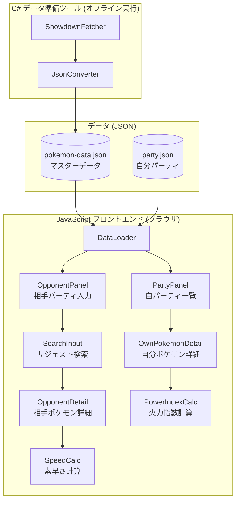
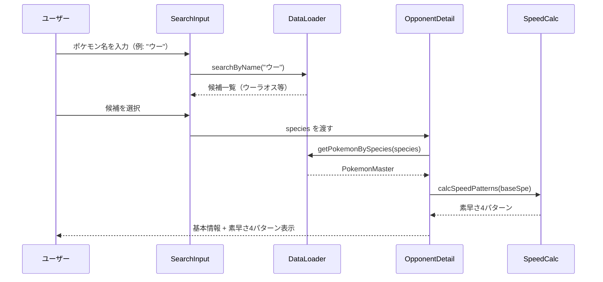
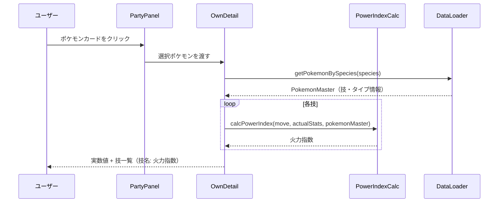
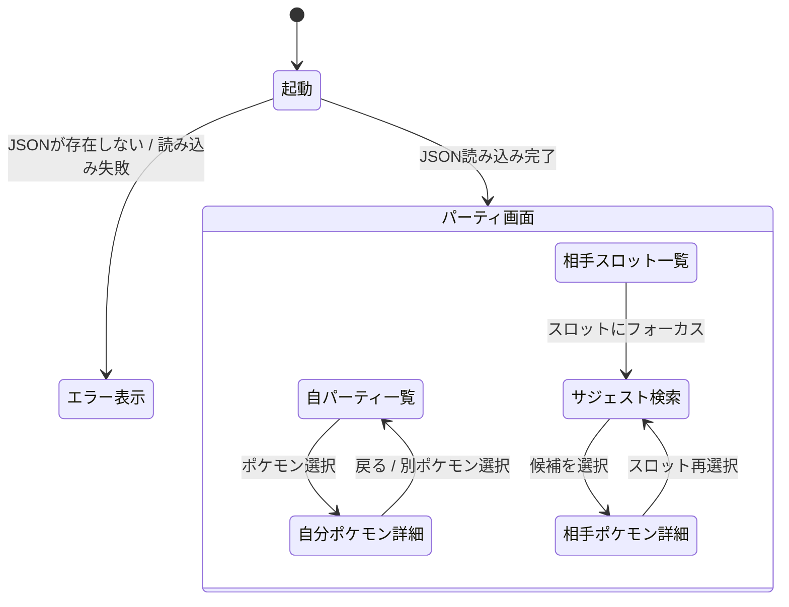

# 機能設計書 (Functional Design Document)

## システム構成図



---

## 技術スタック

| 分類 | 技術 | 選定理由 |
|------|------|----------|
| フロントエンド言語 | JavaScript (ESモジュール) | TypeScript不要のシンプルな個人ツール |
| フロントエンドフレームワーク | 未決定（Vanilla JS or 軽量FW） | architecture.md で確定 |
| スタイリング | CSS | 追加依存なし |
| データ取得・変換 | C# (.NET) | JSON操作と外部データ取得が得意 |
| マスターデータ | Pokémon Showdown データ | 対戦用途に必要な情報を網羅 |
| テスト | Vitest | JavaScript対応、高速 |

---

## データモデル定義

### エンティティ: PokemonMaster（マスターデータ）

C# ツールが生成する `pokemon-data.json` の構造:

```json
{
  "pokemon": {
    "pikachu": {
      "name": "ピカチュウ",
      "nameKana": "ピカチュウ",
      "nameHira": "ぴかちゅう",
      "types": ["Electric"],
      "baseStats": {
        "hp": 35, "atk": 55, "def": 40,
        "spa": 50, "spd": 50, "spe": 90
      },
      "abilities": ["Static", "Lightning Rod"],
      "moves": [
        {
          "name": "10まんボルト",
          "type": "Electric",
          "category": "special",
          "power": 90
        }
      ]
    }
  }
}
```

**制約**:
- `category` は `"physical"` / `"special"` / `"status"` のいずれか
- `power` は変動技（メトロノーム等）の場合 `null`（最大値で代替計算）
- ひらがな/カタカナ両方を保持してサジェスト検索に対応

---

### エンティティ: UserParty（自分パーティ）

ユーザーが編集する `party.json` の構造:

```json
{
  "party": [
    {
      "species": "pikachu",
      "nickname": "ピカチュウ",
      "ability": "Static",
      "item": "でんきだま",
      "nature": "おくびょう",
      "actualStats": {
        "hp": 266, "atk": 121, "def": 90,
        "spa": 261, "spd": 111, "spe": 262
      },
      "moves": [
        { "name": "10まんボルト" },
        { "name": "シャドーボール" },
        { "name": "めざめるパワー" },
        { "name": "まもる" }
      ]
    }
  ]
}
```

**制約**:
- `species` はマスターデータのキーと一致すること
- `actualStats` はユーザーが実数値を直接入力する（計算は行わない）
- `moves` の技名はマスターデータに存在すること（不明技は補正値1.0として処理）

---

### エンティティ: OpponentParty（相手パーティ・UI状態）

ブラウザ上のみで管理するメモリ状態（永続化しない）:

```json
{
  "slots": [
    { "species": "rillaboom", "selected": true },
    { "species": null, "selected": false },
    { "species": null, "selected": false },
    { "species": null, "selected": false },
    { "species": null, "selected": false },
    { "species": null, "selected": false }
  ]
}
```

---

## コンポーネント設計

### DataLoader

**責務**: アプリ起動時に JSON ファイルを読み込み、各コンポーネントにデータを供給する

```
DataLoader
  load()                  → { pokemonMaster, userParty }
  getPokemonBySpecies(id) → PokemonMaster | null
  searchByName(query)     → PokemonMaster[]  ※ひらがな/カタカナ正規化後に前方一致
```

---

### PartyPanel（自分）

**責務**: 自分パーティ6匹を一覧表示し、選択時に OwnPokemonDetail へ切り替える

**表示項目（カード）**: ポケモン名、タイプ

---

### OwnPokemonDetail

**責務**: 選択した自分ポケモンの詳細と火力指数を表示する

**表示項目**:
- ポケモン名 / タイプ / 特性 / 持ち物
- 実数値（H-A-B-C-D-S）
- 技一覧: `技名 : 火力指数`（変化技は「−」）

**依存**: PowerIndexCalc

---

### OpponentPanel

**責務**: 相手パーティ6スロットを管理し、各スロットに SearchInput を配置する

---

### SearchInput

**責務**: ポケモン名をひらがな/カタカナ対応でサジェスト検索し、選択後に OpponentDetail へ渡す

**動作**:
1. 入力文字を正規化（ひらがな→カタカナ統一）
2. マスターデータの `nameKana` / `nameHira` に前方一致検索
3. 候補一覧を表示（最大10件）
4. 選択後 `species` を確定し OpponentDetail に渡す

---

### OpponentDetail

**責務**: 選択した相手ポケモンの基本情報と素早さ4パターンを表示する

**表示項目**:
- ポケモン名 / タイプ / 特性候補一覧
- 種族値（H-A-B-C-D-S）
- 素早さ4パターン（SpeedCalc が計算）

**依存**: SpeedCalc

---

### PowerIndexCalc

**責務**: 火力指数を計算する純粋関数モジュール

```
calcPowerIndex(move, pokemon, pokemonMaster) → number | null
```

---

### SpeedCalc

**責務**: 素早さ4パターンを計算する純粋関数モジュール

```
calcSpeedPatterns(baseSpe) → { fastest, fast, neutral, slowest }
```

---

## ユースケース図

### 相手ポケモン情報の参照



---

### 自分ポケモンの火力確認



---

## 画面遷移図



---

## アルゴリズム設計

### 火力指数計算

**目的**: 自分ポケモンの各技がどの程度の火力を持つかを相対的に比較できる指標を算出する

**計算式**:

| 技カテゴリ | 計算式 |
|-----------|--------|
| 物理技 | `威力 × 攻撃実数値 × タイプ一致補正 × 特性補正 × 持ち物補正` |
| 特殊技 | `威力 × 特攻実数値 × タイプ一致補正 × 特性補正 × 持ち物補正` |
| 変化技 | `null`（表示は「−」） |

**各補正値の詳細**:

```
タイプ一致補正:
  - 技タイプ ∈ ポケモンタイプ → 1.5
  - それ以外 → 1.0

特性補正:
  - 未定義の特性 → 1.0（デフォルト）
  - 定義あり → party.json に補正値を記載（例: もうか → 1.5）

持ち物補正:
  - 未定義の持ち物 → 1.0（デフォルト）
  - 定義あり → party.json に補正値を記載（例: いのちのたま → 1.3）

威力の特殊ケース:
  - 威力不定技（power = null） → 代替最大値を使用
  - 複数回攻撃技 → 最大総威力で計算
```

**実装例**:

```js
function calcPowerIndex(move, actualStats, pokemonTypes, abilityModifier, itemModifier) {
  if (move.category === 'status') return null;

  const basePower = move.power ?? move.maxPower;
  const attackStat = move.category === 'physical' ? actualStats.atk : actualStats.spa;
  const stab = pokemonTypes.includes(move.type) ? 1.5 : 1.0;

  return basePower * attackStat * stab * abilityModifier * itemModifier;
}
```

---

### 素早さ4パターン計算

**目的**: 相手ポケモンが取りうる素早さの範囲を4パターンで表示し、先手・後手の判断を補助する

**計算式** (レベル50):

```
素早さ実数値 = floor( floor((2×種族値 + IV + floor(EV/4)) × 50/100) + 5 ) × 性格補正
```

| パターン | IV | EV | 性格補正 |
|---------|----|----|---------|
| 最速     | 31 | 252 | 1.1 |
| 準速     | 31 | 252 | 1.0 |
| 無振り   | 31 | 0   | 1.0 |
| 最遅     | 0  | 0   | 0.9 |

**実装例**:

```js
function calcSpeed(baseSpe, iv, ev, natureModifier) {
  return Math.floor(
    Math.floor((2 * baseSpe + iv + Math.floor(ev / 4)) * 50 / 100 + 5) * natureModifier
  );
}

function calcSpeedPatterns(baseSpe) {
  return {
    fastest:  calcSpeed(baseSpe, 31, 252, 1.1),
    fast:     calcSpeed(baseSpe, 31, 252, 1.0),
    neutral:  calcSpeed(baseSpe, 31,   0, 1.0),
    slowest:  calcSpeed(baseSpe,  0,   0, 0.9),
  };
}
```

---

## UI設計

### レイアウト

```
┌─────────────────────────────────────────────────────────┐
│  [自分パーティ]               [相手パーティ]              │
│                                                         │
│  ┌──────┐ ┌──────┐ ┌──────┐  □______ □______ □______  │
│  │ ポケモン│ │ ポケモン│ │ ポケモン│  □______ □______ □______  │
│  │  名前  │ │  名前  │ │  名前  │                         │
│  │ タイプ │ │ タイプ │ │ タイプ │  ┌─────────────────────┐ │
│  └──────┘ └──────┘ └──────┘  │ [相手ポケモン詳細]      │ │
│  ┌──────┐ ┌──────┐ ┌──────┐  │ 種族値 / 特性候補      │ │
│  │ ポケモン│ │ ポケモン│ │ ポケモン│  │ 素早さ4パターン       │ │
│  └──────┘ └──────┘ └──────┘  └─────────────────────┘ │
│                                                         │
│  ┌──────────────────────────┐                           │
│  │ [自分ポケモン詳細]         │                           │
│  │ 実数値 / 特性 / 持ち物     │                           │
│  │ 技名: 火力指数             │                           │
│  └──────────────────────────┘                           │
└─────────────────────────────────────────────────────────┘
```

### サジェスト検索UI

```
□ ウー
  ┌─────────────────┐
  │ ウーラオス（一撃） │
  │ ウーラオス（連撃） │
  └─────────────────┘
```

---

## ファイル構造

```
data/
├── pokemon-data.json   # C# ツールが生成するマスターデータ
└── party.json          # ユーザーが手編集する自分パーティ定義
```

---

## エラーハンドリング

| エラー種別 | 処理 | ユーザーへの表示 |
|-----------|------|-----------------|
| `party.json` が見つからない | 起動を中断 | 「party.json が見つかりません」 |
| `pokemon-data.json` が見つからない | 起動を中断 | 「pokemon-data.json が見つかりません。C# ツールを実行してください」 |
| 技名がマスターデータに存在しない | 補正値1.0として計算を継続 | （ユーザーへの表示なし） |
| ポケモン名入力で候補なし | 候補一覧を非表示 | 「見つかりません」 |
| 空欄のスロット選択 | 何もしない | — |

---

## テスト戦略

### ユニットテスト

- `calcPowerIndex`: 物理技・特殊技・変化技・威力不定技・補正なしのケース
- `calcSpeedPatterns`: 素早さ種族値を変えた4パターン計算の正確性
- `searchByName`: ひらがな/カタカナ混在クエリの正規化と前方一致
- `DataLoader.load`: 正常系 / ファイル不存在時のエラー

### 統合テスト

- `party.json` → DataLoader → OwnPokemonDetail の火力指数表示フロー
- ポケモン名入力 → サジェスト → 相手詳細表示フロー
